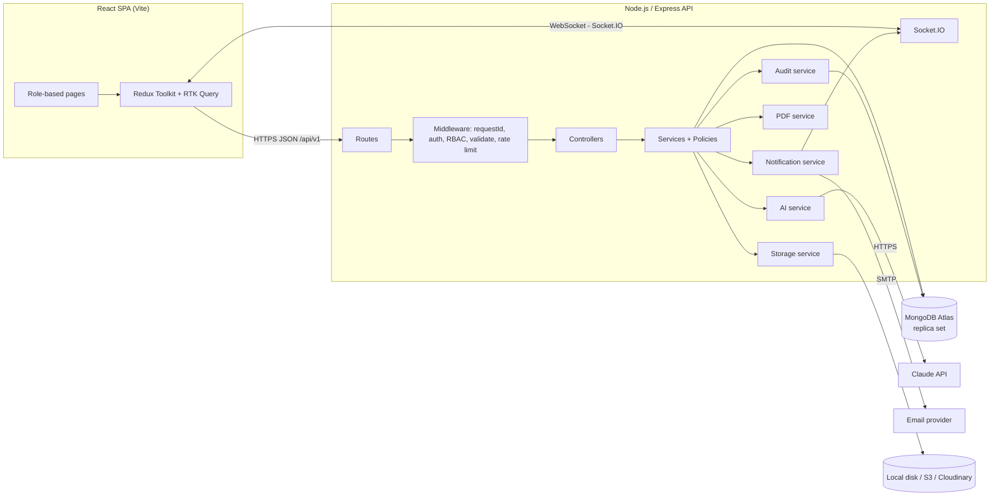
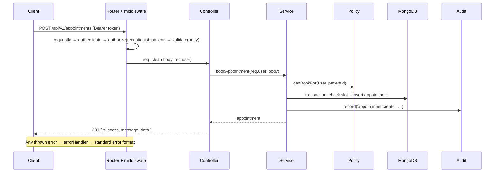
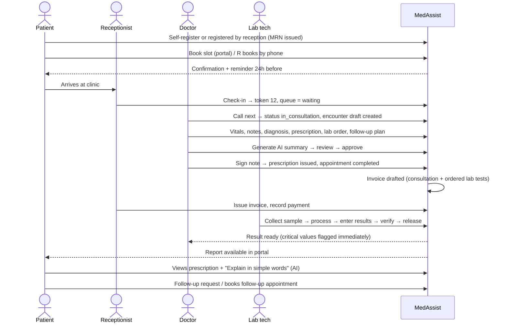
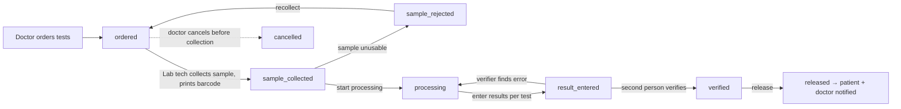
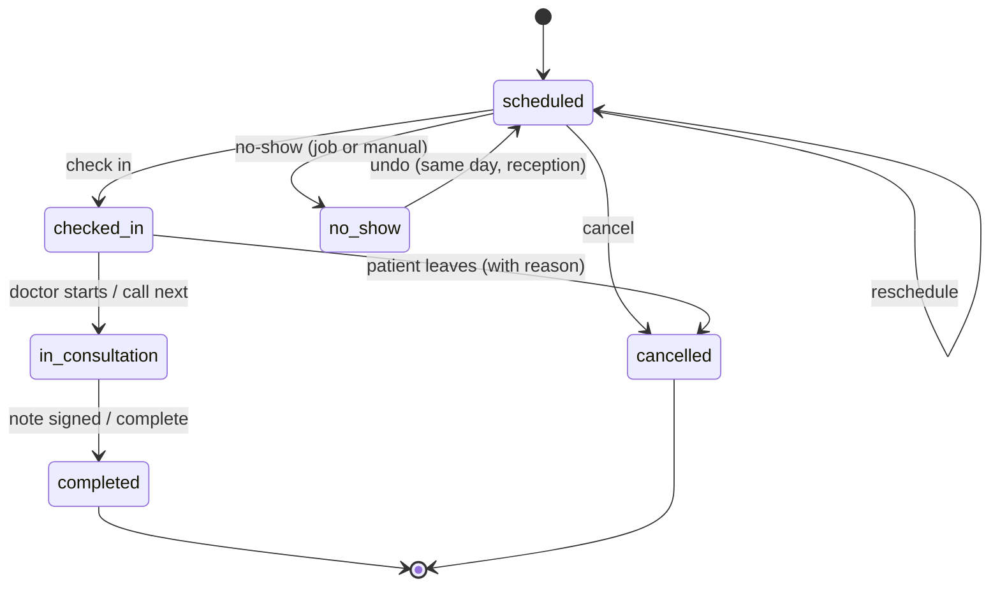
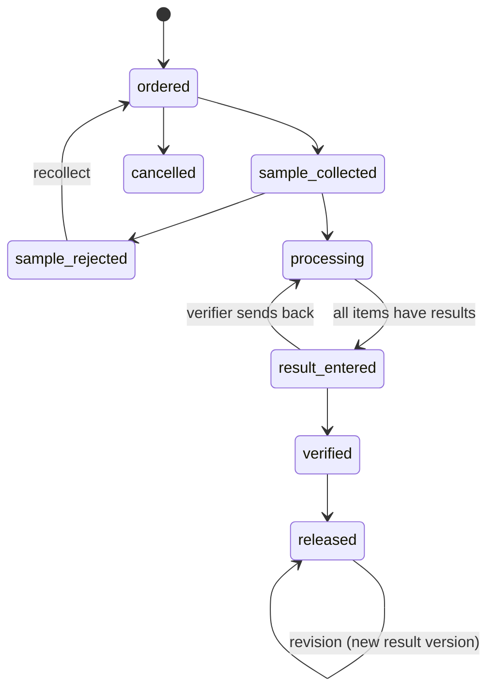
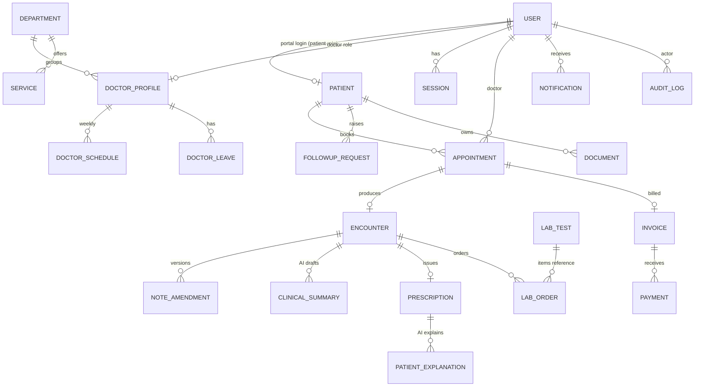

# MedAssist – Project Specification

> **Clinic Operations & Patient Care Portal** · MERN · AI-enabled capstone
> Version 1.0 · Living document
>
> This file is the single source of truth for *what* MedAssist does. `CLAUDE.md` summarises the rules; this file holds the detail. If the code and this spec disagree, flag it and update one of them — never diverge silently. Build only what the current phase asks for (see §19).

---

## Table of contents

1. [Overview](#1-overview)
2. [Users, roles and permissions](#2-users-roles-and-permissions)
3. [System architecture](#3-system-architecture)
4. [Core workflows](#4-core-workflows)
5. [State machines](#5-state-machines)
6. [Data model (MongoDB schemas)](#6-data-model-mongodb-schemas)
7. [REST API specification](#7-rest-api-specification)
8. [Business rules](#8-business-rules)
9. [AI features](#9-ai-features)
10. [Security, privacy and audit](#10-security-privacy-and-audit)
11. [Notifications](#11-notifications)
12. [Search, documents and printing](#12-search-documents-and-printing)
13. [Frontend specification](#13-frontend-specification)
14. [Dashboards and reports](#14-dashboards-and-reports)
15. [Testing strategy and seed data](#15-testing-strategy-and-seed-data)
16. [Error code catalogue](#16-error-code-catalogue)
17. [Non-functional requirements](#17-non-functional-requirements)
18. [Environments and deployment](#18-environments-and-deployment)
19. [Build phases mapped to this spec](#19-build-phases-mapped-to-this-spec)
20. [Open decisions](#20-open-decisions)

---

## 1. Overview

### 1.1 Purpose
MedAssist runs the day-to-day operations of a single outpatient clinic: registering patients, booking and running appointments, recording consultations, prescribing, ordering and reporting lab tests, billing, and follow-up. Patients get a portal to see their own appointments, prescriptions, reports and invoices. AI helps doctors write concise clinical summaries (always reviewed by the doctor) and helps patients understand their instructions in plain language (never diagnosing or changing treatment).

### 1.2 Goals
- One system for all five roles, each seeing only what they need.
- No double-booking; a live queue for the waiting room.
- A complete, chronological patient timeline.
- A traceable lab workflow from order to released result.
- Accurate invoices with partial payments.
- Every sensitive action is recorded in an append-only audit log.
- AI that saves clinicians time without taking clinical decisions.

### 1.3 Out of scope (v1)
- Multiple clinics / branches (single tenant only).
- Pharmacy inventory and dispensing.
- Insurance claims processing (insurance details are stored, not processed).
- Real payment gateway (payments are recorded manually; the model allows adding one later).
- Telemedicine video calls.
- HL7 / FHIR integration with external systems.
- Native mobile apps (the web app is responsive instead).

### 1.4 Glossary
| Term | Meaning |
|---|---|
| **MRN** | Medical Record Number. The clinic's unique patient ID, e.g. `MRN-000123`. |
| **Encounter** | One consultation between a doctor and a patient, tied to one appointment. Holds the clinical note. |
| **Clinical note** | The structured record of the encounter: vitals, complaint, examination, diagnosis, plan. |
| **Sign / signed** | The doctor finalises a note. After signing it can only be changed through an amendment. |
| **Amendment** | An append-only correction to a signed note, with a reason. |
| **Care relationship** | A link that allows a doctor to see a patient's clinical records (§2.3). |
| **Token** | The queue number given to a patient at check-in. |
| **Release** | Making a verified lab result visible to the patient. |
| **Slot** | A bookable time window in a doctor's schedule. |
| **Paise** | 1/100 of a rupee. All money is stored as integer paise. |

### 1.5 Assumptions
- One clinic, one timezone (default `Asia/Kolkata`), one currency (default `INR`). Both are configurable in clinic settings.
- Dates are stored in UTC and shown in the clinic timezone.
- Plain-language explanations are offered in English and Hindi to start (the list is configurable).
- This is a capstone/demo system. It follows healthcare privacy principles (least privilege, audit trails, data minimisation, consent — in the spirit of India's DPDP Act 2023 and HIPAA) but is **not** certified for real clinical use.

---

## 2. Users, roles and permissions

### 2.1 Roles
| Role key | Who | Main jobs |
|---|---|---|
| `admin` | Clinic administrator | Clinic settings, users, departments, services, doctor schedules, lab test catalogue, billing settings, reports, audit logs. **No access to clinical content by default.** |
| `doctor` | Physician | Own calendar and queue, clinical notes, diagnoses, prescriptions, lab orders, follow-up plans, reviewing AI summaries, reviewing lab results. |
| `receptionist` | Front desk | Register patients, book / reschedule / cancel appointments, check-in and queue, invoices and payments, triage follow-up requests. **No access to clinical notes.** |
| `labtech` | Lab technician | Lab worklist, sample collection, result entry, verification, release, report upload. Sees only the minimum patient details needed. |
| `patient` | Patient | Own profile, appointments (book / cancel within policy), prescriptions, released lab reports, invoices, follow-up requests, AI explanations. |

A user has exactly **one** role. A patient user is linked to exactly one `Patient` record.

### 2.2 Access principles
1. **Deny by default.** Every route declares which roles may call it.
2. **Role check + ownership / relationship check.** Passing the role check is not enough for patient data; the service also checks *which* patient.
3. **Minimum necessary.** Responses are shaped per role (e.g. lab techs get name, MRN, age, sex — not address or history).
4. **Admins are not clinicians.** Admins manage the clinic but cannot read notes, prescriptions or results.
5. **Every read of clinical data is audited**, not just writes.

### 2.3 Care relationship (doctor → patient)
A doctor may read a patient's clinical records (notes, prescriptions, lab results, documents) if **any** of these is true:
- The doctor has a non-cancelled appointment with the patient (past, today, or future).
- The doctor ordered a lab test for the patient.
- A follow-up request from the patient is assigned to the doctor.

Doctors may only **write** clinical records (notes, prescriptions, lab orders) for encounters on their **own** appointments.

*Optional stretch — "break-glass" access:* a doctor without a care relationship can request emergency access by giving a reason. Access lasts 24 hours, is flagged in the audit log, and notifies admins.

Implement all of this in **one policy module** (`server/src/policies/patientAccess.js`) exposing `canAccessPatient(user, patientId, scope)` where `scope` is `demographics | clinical | billing | lab`. Services call it — controllers do not reimplement the rules.

### 2.4 Permission matrix
Legend: **C** create · **R** read · **U** update · **D** deactivate/cancel · **own** = only records belonging to the user · **rel** = only patients with a care relationship · **—** no access.

| Resource | Admin | Doctor | Receptionist | Lab tech | Patient |
|---|---|---|---|---|---|
| Clinic settings | R U | R (public subset) | R (public subset) | R (public subset) | R (public subset) |
| Users (staff) | C R U D | R own | R own | R own | R own |
| Departments / services | C R U D | R | R | R | R |
| Doctor profiles & schedules | C R U D | R, U own schedule & leave | R | R | R (public fields) |
| Lab test catalogue | C R U D | R | R | R | R (name, price) |
| Patients – demographics | R | R rel | C R U | R (minimal) | R U own |
| Appointments | R | R own, U status own | C R U D | — | C R D own (policy) |
| Queue | R | R U own | R U | — | R own position |
| Encounters / clinical notes | — | C R U own; R rel | — | — | R own **signed** (summary view) |
| Clinical summaries (AI) | — | C R U own | — | — | R own **approved** |
| Prescriptions | — | C R U own; R rel | R (print only) | — | R own **issued** |
| Lab orders | R (counts only) | C R own; R rel | R (status, for billing) | R U | R own **released** |
| Lab results | — | R rel | — | C R U | R own **released** |
| Invoices & payments | R | R own patients (summary) | C R U | — | R own |
| Follow-up requests | R | R U assigned | R U | — | C R own |
| Documents | R metadata | C R rel | C R (non-clinical categories) | C R (lab reports) | C R own (visible) |
| Notifications | R U own | R U own | R U own | R U own | R U own |
| Audit logs | R | — | — | — | — |
| Reports & analytics | R | R own stats | R operational | R lab stats | — |
| AI interaction log | R | — | — | — | — |

### 2.5 Field-level visibility examples
| Data | Admin | Doctor (rel) | Receptionist | Lab tech | Patient (own) |
|---|---|---|---|---|---|
| Name, MRN, age, sex | ✔ | ✔ | ✔ | ✔ | ✔ |
| Phone, email, address | ✔ | ✔ | ✔ | ✘ | ✔ |
| Allergies, chronic conditions | ✘ | ✔ | ✘ | ✔ (allergies only) | ✔ |
| Insurance | ✔ | ✘ | ✔ | ✘ | ✔ |
| Internal admin notes | ✔ | ✘ | ✔ | ✘ | ✘ |

Implement with per-role **serializers** (`toAdminView`, `toDoctorView`, …) in each module, never by returning raw Mongoose documents.

---

## 3. System architecture

### 3.1 High-level view



### 3.2 Tech stack
| Layer | Choice | Notes |
|---|---|---|
| Runtime | Node.js 20+, ES modules | JavaScript, no TypeScript |
| API | Express 4 | REST, JSON, `/api/v1` |
| Database | MongoDB (Atlas in prod), Mongoose 8 | Replica set required for transactions |
| Validation | Zod | Body, query, params, and env |
| Auth | JWT access token + rotating refresh token (httpOnly cookie) | bcrypt for passwords |
| Logging | Pino + pino-http | Redaction, request ids |
| Real-time | Socket.IO | Queue board and notifications |
| Files | Multer → storage adapter (local in dev, S3/Cloudinary in prod) | |
| PDF | PDFKit | Invoices, prescriptions, lab reports, visit summaries |
| Email | Nodemailer (Ethereal in dev) | |
| AI | Anthropic Claude API via `@anthropic-ai/sdk` | Model set by env; `mock` provider for dev/tests |
| Frontend | React 18, Vite, React Router v6 | |
| State | Redux Toolkit + RTK Query | Access token in memory only |
| UI | Tailwind CSS, Headless UI, react-big-calendar, Recharts, react-hot-toast | |
| Forms | react-hook-form + Zod resolver | |
| Dates | date-fns + date-fns-tz | |
| Tests | Vitest, Supertest, mongodb-memory-server (replica set), React Testing Library, Playwright (E2E, optional) | |

### 3.3 Backend layers and request lifecycle
- **Route** – path, HTTP method, `authenticate`, `authorize(...roles)`, `validate(schema)`, controller.
- **Controller** – thin: reads the request, calls one service function, sends `sendSuccess()`.
- **Service** – business logic, policy checks, transactions, audit and notification calls.
- **Policy** – pure functions answering "may this user do X to this record?".
- **Model** – Mongoose schema, indexes, immutability hooks.
- **Serializer** – shapes documents for the caller's role.



### 3.4 Backend folder structure
```
server/src/
├── app.js  server.js  socket.js
├── config/        env.js  db.js  constants.js (roles, statuses, enums)
├── middlewares/   requestId  authenticate  authorize  validate  rateLimiters  upload  auditContext  notFound  errorHandler
├── policies/      patientAccess.js  appointmentPolicy.js  …
├── services/      audit.service.js  notification.service.js  pdf.service.js  storage.service.js  counter.service.js  email.service.js
├── ai/            ai.service.js  providers/{anthropic.js,mock.js}  prompts/{clinicalSummary.v1.js,patientExplanation.v1.js}  guardrails.js
├── modules/
│   ├── auth/  users/  settings/  departments/  services/  doctors/  schedules/
│   ├── patients/  appointments/  queue/  encounters/  summaries/  prescriptions/
│   ├── followups/  labTests/  labOrders/  invoices/  payments/  documents/
│   ├── notifications/  dashboards/  reports/  audit/  search/  health/
│   │   └── each: model.js service.js controller.js routes.js validation.js serializer.js
├── utils/         logger  ApiError  ApiResponse  asyncHandler  money  dates  pagination
├── jobs/          reminders.job.js  noShow.job.js  (node-cron)
└── seed/          index.js  factories/
```

### 3.5 Frontend architecture
```
client/src/
├── app/           store.js  apiSlice.js (RTK Query base with auto-refresh)
├── features/      auth/ patients/ appointments/ queue/ encounters/ prescriptions/ labs/ billing/ followups/ admin/ notifications/ dashboards/
│                  each: api.js (RTK Query endpoints)  components/  pages/  schemas.js
├── layouts/       AuthLayout  AppLayout (sidebar by role)  PrintLayout
├── routes/        AppRoutes.jsx  ProtectedRoute.jsx  RoleRoute.jsx  routeConfig.js
├── components/    ui/ (Button, Input, Select, Modal, Table, Badge, EmptyState, Skeleton, ConfirmDialog, Pagination, DateRangePicker)
├── hooks/  utils/  constants/ (roles, statuses mirrored from server)
```

### 3.6 Environment variables
**Server**
| Variable | Example | Purpose |
|---|---|---|
| `NODE_ENV` | development | development / test / production |
| `PORT` | 5000 | |
| `MONGO_URI` | mongodb+srv://… | Must be a replica set |
| `CLIENT_URL` | http://localhost:5173 | CORS origin, email links |
| `LOG_LEVEL` | info | |
| `JWT_ACCESS_SECRET` | (random 64 chars) | |
| `JWT_ACCESS_EXPIRES_IN` | 15m | |
| `REFRESH_TOKEN_TTL_DAYS` | 7 | |
| `COOKIE_SECURE` | false (dev) / true (prod) | |
| `COOKIE_SAMESITE` | lax (dev) / none (prod cross-site) | |
| `BCRYPT_ROUNDS` | 12 | |
| `AI_PROVIDER` | anthropic / mock | |
| `ANTHROPIC_API_KEY` | … | Only when provider = anthropic |
| `AI_MODEL` | (Claude model id) | Keep configurable |
| `AI_TIMEOUT_MS` | 30000 | |
| `STORAGE_DRIVER` | local / s3 / cloudinary | |
| `UPLOAD_DIR` | ./uploads | local driver |
| `MAX_UPLOAD_MB` | 10 | |
| `EMAIL_TRANSPORT` | console / smtp | `console` logs recipient, subject and links (dev/test only); `smtp` required in production (§20 D8) |
| `SMTP_HOST` `SMTP_PORT` `SMTP_USER` `SMTP_PASS` `MAIL_FROM` | | Email (required when `EMAIL_TRANSPORT=smtp`) |
| `AUDIT_HASH_SECRET` | (random) | HMAC for audit hash chain |

**Client**: `VITE_API_URL`, `VITE_SOCKET_URL`, `VITE_APP_NAME`.

### 3.7 Cross-cutting conventions
- **IDs:** MongoDB ObjectIds internally. Human-readable numbers (`MRN-000123`, `APT-2026-000045`, `ENC-…`, `RX-…`, `LAB-…`, `INV-…`, `PAY-…`) come from an atomic `Counter` collection.
- **Time:** store UTC `Date`. Business "days" are computed in the clinic timezone. Clock times in schedules are `"HH:mm"` strings in the clinic timezone.
- **Money:** integer **paise**. Never floats. Format only in the UI.
- **Soft delete:** master data uses `isActive: false`. Clinical and financial records are **never** deleted — they are cancelled, voided or amended.
- **Snapshots:** records that must stay historically accurate copy the values they depend on (e.g. an invoice line copies the service name and price).
- **Optimistic concurrency:** `optimisticConcurrency: true` on Encounter, Prescription, LabOrder, Invoice. A stale save returns `409 CONFLICT`.
- **Status changes use action endpoints** (`POST /appointments/:id/cancel`), not a generic `PATCH status`, so each change is validated, audited and has side effects.
- **Every status change** appends to a `statusHistory` array: `{ status, at, by, note }`.

---

## 4. Core workflows

### 4.1 End-to-end patient journey



### 4.2 Admin: initial clinic setup
1. First admin is created by the seed script (or `npm run create-admin`).
2. Admin completes **clinic settings**: name, logo, address, contact, registration no., GSTIN, timezone, currency, working days/hours, appointment rules, billing rules (tax, invoice prefix, payment methods), lab rules, AI toggles.
3. Creates **departments** (General Medicine, Paediatrics, Dermatology, Orthopaedics…).
4. Creates **services** with price and duration (e.g. "General consultation – ₹500 – 15 min").
5. Creates **lab tests** with parameters and reference ranges.
6. Creates **staff users** (doctor, receptionist, labtech). New staff get a temporary password and `mustChangePassword: true`.
7. For each doctor: fills the **doctor profile** (department, specialisation, fee, slot length) and **weekly schedule**; records **leave** as needed.
8. Reviews dashboards, reports and audit logs daily.

### 4.3 Receptionist: patient registration
1. Search by phone / name / MRN first.
2. On "New patient", the system runs a **duplicate check** (same phone + date of birth, or same name + DOB). Possible duplicates are shown; the receptionist either opens the existing record or confirms "create anyway" (recorded in audit).
3. Fills demographics, emergency contact, allergies (if known), insurance, preferred language, consent flags.
4. System issues an MRN.
5. Optionally **invites the patient to the portal**: creates a `patient` user linked to this record and emails a set-password link.

### 4.4 Patient self-registration and portal onboarding
1. Patient signs up with name, email, phone, DOB, password.
2. System checks for an existing patient record with the same phone + DOB:
   - Match without a linked user → creates the user but marks the link **pending**; reception verifies identity at the next visit and confirms the link. (Prevents strangers claiming someone's records.)
   - No match → creates a new Patient record + user.
3. Email verification link (stretch) → patient can book appointments.

### 4.5 Appointment booking
1. Choose department → doctor (or "any available") → service → date.
2. Client calls `GET /doctors/:id/slots?date=&serviceId=` → server returns free slots (§8.1).
3. User picks a slot → `POST /appointments`.
4. Server re-checks inside a **transaction** (§8.2): slot still inside availability, no doctor clash, no patient clash, booking window and daily limit respected.
5. On success: appointment `scheduled`, notification to patient (and doctor for same-day bookings), audit entry.
6. On clash: `409 SLOT_UNAVAILABLE`; UI refreshes slots.

**Reschedule:** same checks for the new slot, done atomically (the old slot is released only if the new one is taken). Stores `rescheduleHistory`. Patients may reschedule/cancel only up to `minCancelHours` before start (default 2 h); staff may override with a reason.

**Walk-ins:** receptionist creates an appointment for "now" with `type: walk_in`; it goes straight to `checked_in`. Walk-ins may use an overbook allowance per doctor (setting, default 2 per session).

### 4.6 Check-in and queue
1. Receptionist opens today's list → **Check in** → status `checked_in`, `checkedInAt` set, **token number** assigned (per doctor per day, starting at 1).
2. Queue order: priority (emergency > elderly/priority > normal), then scheduled time, then check-in time.
3. Doctor clicks **Call next** → earliest eligible patient becomes `in_consultation`; the waiting-room board updates live via Socket.IO.
4. Doctor finishes → **Complete** (automatic when the note is signed).
5. Patients not checked in 30 min after their slot end are auto-marked `no_show` by a job (receptionist can undo on the same day).
6. Queue board shows token numbers and doctor room only — **never patient names**.

### 4.7 Doctor: consultation
1. Opens the **consultation workspace** for the appointment. An `Encounter` in `draft` is created on first open (idempotent).
2. Left panel: patient header (name, age, sex, allergies banner, chronic conditions) and **timeline**.
3. Tabs:
   - **Vitals** – BP, pulse, temperature, SpO₂, respiratory rate, weight, height (BMI auto).
   - **Notes** – chief complaint, history, examination, diagnoses (provisional/final, optional ICD-10 code), assessment, plan, advice.
   - **Prescription** – drug items; **allergy warning** if a drug name matches a recorded allergy (simple match; not a clinical decision system).
   - **Lab orders** – pick tests from the catalogue, priority, clinical notes.
   - **Follow-up** – needed? after N days / on date, instructions.
   - **AI summary** – generate, edit, approve (§9.2).
4. Auto-save draft every 10 s (debounced PATCH).
5. **Sign** → validation (chief complaint and at least one diagnosis required), then in one transaction: encounter `signed`, prescription `issued`, lab orders submitted, appointment `completed`, follow-up reminder scheduled, invoice draft created/updated.
6. After signing, corrections go through **Amend** with a mandatory reason; each amendment creates a new version.

### 4.8 Lab workflow

- Results are entered per test item with values per parameter. The system flags each value `normal / low / high / critical` using reference ranges (sex/age specific when defined).
- **Critical** values notify the ordering doctor immediately, even before release.
- **Verification** must be done by a different lab tech from the one who entered results when `settings.lab.requireDualVerification` is on (default on; with one lab tech in a demo, admin can turn it off).
- **Release** generates a PDF lab report (stored as a Document) and makes the results visible to the patient.
- Corrections after release: "Revise" creates a new result version with a reason; the patient and doctor are notified; old versions remain visible to staff.

### 4.9 Billing
1. When an encounter is signed, a **draft invoice** is created (or updated) for the appointment with: consultation service line + one line per ordered lab test. Prices are snapshotted.
2. Receptionist reviews, may add lines (procedure, other) or discounts (discount above `settings.billing.maxDiscountPercent` needs admin), then **Issue**. Issued invoices are locked.
3. **Record payment(s):** method (cash, card, UPI, insurance, other), amount, reference. Status becomes `partially_paid` or `paid`.
4. **Void** an issued invoice with a reason (admin or receptionist with reason); cannot void if payments exist without refunding first.
5. **Refund** creates a negative payment record linked to the original.
6. Printable/downloadable PDF invoice and receipt.

### 4.10 Follow-up workflow
- **Doctor-planned:** the follow-up plan on a signed encounter creates a reminder notification to the patient N days before the date with a "Book follow-up" link (pre-selects the doctor and `type: follow_up`, linked via `followUpOf`).
- **Patient-initiated follow-up request:** patient selects a related visit and a type (question, new/worsening symptom, report review, prescription refill request, reschedule), writes a message, optional attachment.
  - The request goes to the reception triage list and to the related doctor.
  - Receptionist or doctor can **respond** (message), **schedule** (creates an appointment), or **close / reject** with a reason.
  - The portal shows a banner: *"This is not for emergencies. If this is an emergency, call your local emergency number."*

### 4.11 AI clinical summary (doctor)
See §9.2. Short version: doctor clicks **Generate summary** → server builds de-identified input from the structured note → LLM returns structured JSON → validated → shown as an editable **draft** clearly labelled "AI draft – review before use" → doctor edits and **approves** (or rejects) → approved summary appears in the timeline as "AI-assisted, reviewed by Dr X".

### 4.12 AI plain-language explanation (patient)
See §9.3. Patient opens an issued prescription or follow-up plan → **Explain in simple words** (chooses language) → server explains using only the recorded instructions → guardrail checks → shown with a fixed disclaimer and a "Contact the clinic" button. Cached per prescription version + language.

### 4.13 Doctor leave affecting booked appointments
1. Admin or doctor adds leave.
2. System finds `scheduled` appointments in that period and returns them in the response (and a notification to reception).
3. Reception reschedules or cancels each one; patients are notified. Leave cannot be saved over `in_consultation`/`completed` appointments.

---

## 5. State machines

Invalid transitions must return `409 INVALID_STATUS_TRANSITION`. Implement each machine as a transition table in `config/constants.js` and one helper `assertTransition(machine, from, to)`.

### 5.1 Appointment

| Action | From | To | Roles | Side effects |
|---|---|---|---|---|
| book | – | scheduled | receptionist, patient, admin | notify, audit |
| reschedule | scheduled | scheduled | receptionist, patient (policy), admin | history entry, notify |
| cancel | scheduled, checked_in | cancelled | receptionist, patient (policy), admin, doctor (own) | free slot, notify, void draft invoice |
| check-in | scheduled | checked_in | receptionist | token assigned, queue update |
| start | checked_in | in_consultation | doctor (own) | encounter draft, queue update |
| complete | in_consultation | completed | doctor (own), system on sign | queue update |
| no-show | scheduled | no_show | receptionist, system job | notify patient |
| undo no-show | no_show | scheduled | receptionist (same day) | audit |

### 5.2 Encounter (clinical note)
`draft → signed → amended (→ amended …)`. Draft is editable only by its doctor. `signed` and `amended` are read-only; each amendment increments `version`.

### 5.3 Prescription
`draft → issued → (completed | cancelled)`. Issued automatically when the encounter is signed. Items are immutable after issue; a change = cancel with reason + new prescription (linked via `replaces`). `completed` is set by a job when the longest item duration has passed.

### 5.4 Lab order

Order status is derived from its items where relevant (e.g. `result_entered` only when every non-cancelled item has results).

### 5.5 Invoice
`draft → issued → partially_paid → paid`; `issued/partially_paid → void` (after refunds); `paid → partially_paid` only through a refund. Draft is editable; issued is locked.

### 5.6 Follow-up request
`open → in_review → (scheduled | responded | closed | rejected)`; `responded → open` if the patient replies.

### 5.7 AI clinical summary
`generating → draft → (approved | rejected)`; `failed` if the AI call or validation fails (can retry). Only one `approved` summary per encounter version; regenerating after approval creates a new draft and keeps the old approved one until the new one is approved.

### 5.8 User account
`active ⇄ inactive` (admin). `locked` is temporary (`lockUntil` after 5 failed logins in 15 min, 15-minute lock). `mustChangePassword` forces the change-password screen after login.

---
## 6. Data model (MongoDB schemas)

### 6.1 Conventions
- Every schema has `timestamps: true` (`createdAt`, `updatedAt`) and `createdBy` / `updatedBy` (User refs) where a person makes the change.
- Enums live in `config/constants.js` and are shared by schemas, Zod validators and the client constants.
- `ref` fields are ObjectIds. Fields marked **snapshot** copy values at write time.
- Clinical and financial collections block deletes with `pre('deleteOne'|'deleteMany'|'findOneAndDelete')` hooks that throw.
- Notation below: `Type, required?, constraints // comment`.

### 6.2 Entity relationships (simplified)


### 6.3 `users`
```js
{
  firstName: String, required, trim, max 50
  lastName: String, required, trim, max 50
  email: String, required, unique, lowercase, trim
  phone: String, E.164-ish, indexed
  passwordHash: String, required, select: false
  role: enum ['admin','doctor','receptionist','labtech','patient'], required, indexed
  isActive: Boolean, default true
  mustChangePassword: Boolean, default false
  emailVerifiedAt: Date
  lastLoginAt: Date
  failedLoginAttempts: Number, default 0
  lastFailedLoginAt: Date          // start of the 15-min lockout window (§5.8, §20 D10)
  lockUntil: Date
  passwordChangedAt: Date          // tokens issued before this are rejected
  passwordReset: { tokenHash: String, expiresAt: Date }   // select: false
  patient: ObjectId ref Patient     // only for role=patient
  patientLinkStatus: enum ['linked','pending_verification']  // §4.4
  dateOfBirth: Date                 // self-registered patients; used for the Phase 3 match (§20 D29)
  termsAcceptedAt: Date             // consent at registration (§10.6)
  avatarUrl: String
  createdBy: ObjectId ref User
}
indexes: { email: 1 } unique, { role: 1, isActive: 1 }, { patient: 1 } unique sparse
```

### 6.4 `sessions`
```js
{
  user: ObjectId ref User, required, indexed
  refreshTokenHash: String, required, unique   // SHA-256 of the token, never the token itself
  family: String, required, indexed            // rotation family id; reuse of an old token revokes the family
  userAgent: String, ip: String
  lastUsedAt: Date
  expiresAt: Date, required                     // TTL index removes expired sessions
  revokedAt: Date, revokedReason: enum ['logout','logout_all','rotated','reuse_detected','password_changed','admin','deactivated']  // 'rotated' = normal refresh (§20 D4); 'deactivated' = admin deactivation (D24)
  replacedBy: ObjectId ref Session
}
indexes: { expiresAt: 1 } expireAfterSeconds 0
```

### 6.5 `clinic_settings` (single document)
```js
{
  name, logoUrl, tagline, registrationNumber, gstin,
  address: { line1, line2, city, state, postalCode, country },
  phone, email, website,
  timezone: String, default 'Asia/Kolkata'
  currency: String, default 'INR'
  workingDays: [Number 0–6], default [1,2,3,4,5,6]
  appointment: {
    defaultSlotMinutes: Number, default 15
    bookingWindowDays: Number, default 30        // how far ahead patients can book
    minCancelHours: Number, default 2
    allowPatientSelfBooking: Boolean, default true
    maxActiveBookingsPerPatient: Number, default 3
    walkInOverbookPerSession: Number, default 2
    noShowGraceMinutes: Number, default 30
    reminderHoursBefore: Number, default 24
  },
  billing: {
    invoicePrefix: String, default 'INV'
    defaultTaxRateBps: Number, default 0          // basis points: 1800 = 18%
    taxLabel: String, default 'GST'
    maxDiscountPercentWithoutAdmin: Number, default 10
    paymentMethods: [enum 'cash','card','upi','insurance','other']
    invoiceFooter: String
  },
  lab: { requireDualVerification: Boolean, default true, criticalAlertEnabled: Boolean, default true },
  ai: {
    enabled: Boolean, default true
    clinicalSummaryEnabled: Boolean, default true
    patientExplanationEnabled: Boolean, default true
    explanationLanguages: [String], default ['en','hi']
  },
  notifications: { emailEnabled: Boolean, default true },
  updatedBy: ObjectId ref User
}
```

### 6.6 `departments`
```js
{ name: String unique, code: String unique uppercase (e.g. 'GEN'), description, isActive: Boolean default true }
```

### 6.7 `services`
```js
{
  code: String unique, name: String required,
  department: ObjectId ref Department,
  type: enum ['consultation','procedure','other'],
  durationMinutes: Number, default 15, min 5, max 240
  pricePaise: Number, required, min 0, integer
  taxRateBps: Number                 // overrides settings default when set
  isActive: Boolean, default true
}
```

### 6.8 `doctor_profiles`
```js
{
  user: ObjectId ref User, required, unique
  department: ObjectId ref Department, required, indexed
  specialization: String, required
  qualifications: [String]             // ['MBBS','MD (Medicine)']
  registrationNumber: String, required  // medical council registration
  experienceYears: Number
  consultationFeePaise: Number          // default fee if service price not overridden
  slotMinutes: Number                   // overrides clinic default
  roomNumber: String
  bio: String, max 1000
  languages: [String]
  isAcceptingAppointments: Boolean, default true
}
```

### 6.9 `doctor_schedules` (weekly template)
```js
{
  doctor: ObjectId ref User, required
  weekday: Number 0–6, required            // 0 = Sunday
  sessions: [{ start: 'HH:mm', end: 'HH:mm', maxWalkIns: Number }]   // e.g. 09:00–13:00, 17:00–20:00
  effectiveFrom: Date, required
  effectiveTo: Date                          // null = open-ended
}
indexes: { doctor: 1, weekday: 1, effectiveFrom: 1 } unique
validation: sessions within a day must not overlap; start < end
```

### 6.10 `doctor_leaves`
```js
{
  doctor: ObjectId ref User, required, indexed
  startAt: Date, required, endAt: Date, required      // full or partial day
  reason: String, type: enum ['leave','conference','emergency','other']
  createdBy: ObjectId ref User
  isCancelled: Boolean, default false
}
```

### 6.11 `patients`
```js
{
  mrn: String, required, unique              // 'MRN-000123' from Counter
  firstName, lastName: String, required
  dateOfBirth: Date, required
  gender: enum ['male','female','other','unknown'], required
  bloodGroup: enum ['A+','A-','B+','B-','AB+','AB-','O+','O-','unknown']
  phone: String, required, indexed
  email: String, lowercase
  address: { line1, line2, city, state, postalCode, country }
  emergencyContact: { name, relation, phone }
  allergies: [{ substance: String, reaction: String, severity: enum ['mild','moderate','severe'], recordedBy: ref User, recordedAt: Date }]
  chronicConditions: [{ name: String, since: Date, notes: String }]
  insurance: { provider, policyNumber, validTill: Date }
  preferredLanguage: enum ['en','hi'], default 'en'
  consent: {
    dataProcessing: { given: Boolean, at: Date }
    aiExplanations: { given: Boolean, at: Date }     // patient may opt out of AI features
    communications: { email: Boolean, sms: Boolean }
  }
  user: ObjectId ref User                    // portal account, if any
  adminNotes: String                          // front-desk notes, not clinical
  isActive: Boolean, default true
  mergedInto: ObjectId ref Patient            // stretch: duplicate merge
  registeredBy: ObjectId ref User
}
indexes:
  { mrn: 1 } unique
  { phone: 1, dateOfBirth: 1 }               // duplicate detection
  text index on firstName, lastName, mrn, phone, email
virtuals: fullName, age
```

### 6.12 `appointments`
```js
{
  appointmentNumber: String, unique           // 'APT-2026-000045'
  patient: ObjectId ref Patient, required, indexed
  doctor: ObjectId ref User, required, indexed
  department: ObjectId ref Department
  service: ObjectId ref Service
  serviceSnapshot: { name, durationMinutes, pricePaise }      // snapshot
  startAt: Date, required, endAt: Date, required
  type: enum ['new','follow_up','walk_in'], default 'new'
  source: enum ['reception','patient_portal','walk_in','doctor'], required
  reason: String, max 500                    // patient-stated reason, non-clinical
  status: enum ['scheduled','checked_in','in_consultation','completed','cancelled','no_show']
  isSlotActive: Boolean                       // true unless cancelled / no_show (drives the unique index)
  priority: enum ['normal','priority','emergency'], default 'normal'
  queue: { tokenNumber: Number, checkedInAt: Date, calledAt: Date, startedAt: Date, completedAt: Date }
  cancellation: { by: ref User, at: Date, reason: String }
  rescheduleHistory: [{ fromStartAt: Date, toStartAt: Date, by: ref User, at: Date, reason: String }]
  followUpOf: ObjectId ref Appointment
  isOverbook: Boolean, default false
  reminderSentAt: Date
  statusHistory: [{ status, at, by, note }]
  bookedBy: ObjectId ref User
}
indexes:
  { doctor: 1, startAt: 1 } unique, partialFilterExpression { isSlotActive: true }   // hard stop on double-booking (non-overbook)
  { patient: 1, startAt: -1 }
  { doctor: 1, status: 1, startAt: 1 }
  { status: 1, startAt: 1 }                   // no-show and reminder jobs
```
Overbooked walk-ins set `isSlotActive: false` + `isOverbook: true` so they bypass the unique index but are still counted against `walkInOverbookPerSession`.

### 6.13 `encounters` (clinical notes)
```js
{
  encounterNumber: String, unique
  appointment: ObjectId ref Appointment, required, unique
  patient: ObjectId ref Patient, required, indexed
  doctor: ObjectId ref User, required, indexed
  status: enum ['draft','signed','amended'], default 'draft'
  version: Number, default 1
  vitals: {
    bpSystolic: Number 50–260, bpDiastolic: Number 30–160, pulse: Number 20–250,
    temperatureC: Number 30–45, respiratoryRate: Number 5–60, spo2: Number 50–100,
    weightKg: Number 0.5–400, heightCm: Number 30–250, bmi: Number (computed),
    recordedAt: Date, recordedBy: ref User
  }
  chiefComplaint: String, max 1000
  historyOfPresentIllness: String, max 5000
  pastHistory: String, max 3000
  examination: String, max 5000
  diagnoses: [{ description: String required, icd10Code: String, type: enum ['provisional','final'], isPrimary: Boolean }]
  assessment: String, max 3000
  plan: String, max 3000
  adviceToPatient: String, max 2000
  followUp: { required: Boolean, afterDays: Number, date: Date, instructions: String max 1000 }
  signedAt: Date, signedBy: ref User
  lastAmendedAt: Date
}
options: optimisticConcurrency: true
hooks: any update when status !== 'draft' throws RECORD_LOCKED unless done by the amendment service
```

### 6.14 `note_amendments`
```js
{
  encounter: ObjectId ref Encounter, required, indexed
  version: Number, required                // the new version number
  reason: String, required, min 10
  changedFields: [String]
  before: Mixed, after: Mixed              // snapshot of the changed fields only
  amendedBy: ObjectId ref User, required
}
append-only: no updates, no deletes
```

### 6.15 `clinical_summaries` (AI)
```js
{
  encounter: ObjectId ref Encounter, required, indexed
  encounterVersion: Number, required
  patient: ObjectId ref Patient, doctor: ObjectId ref User
  status: enum ['generating','draft','approved','rejected','failed']
  aiDraft: {                                // raw validated AI output (see §9.2)
    oneLineSummary, presentingComplaint, keyFindings: [String], vitalsHighlights: [String],
    assessment, plan: [String], medications: [String], investigations: [String],
    followUp, flagsForClinician: [String]
  }
  finalText: String, max 4000              // doctor-edited text that is shown after approval
  editedByDoctor: Boolean
  aiInteraction: ObjectId ref AiInteraction
  reviewedBy: ObjectId ref User, reviewedAt: Date, rejectionReason: String
}
indexes: { encounter: 1, status: 1 }
```

### 6.16 `prescriptions`
```js
{
  prescriptionNumber: String, unique        // 'RX-2026-000321'
  encounter: ObjectId ref Encounter, required, unique
  appointment, patient, doctor: refs, indexed
  status: enum ['draft','issued','completed','cancelled']
  items: [{
    drugName: String, required             // brand or generic as written
    genericName: String
    strength: String                       // '500 mg'
    form: enum ['tablet','capsule','syrup','injection','drops','cream','ointment','inhaler','other']
    dose: String, required                 // '1 tablet', '5 ml'
    route: enum ['oral','topical','iv','im','sc','inhalation','ophthalmic','otic','nasal','other']
    frequency: enum ['OD','BD','TDS','QID','HS','SOS','STAT','weekly','other']
    frequencyText: String                  // required when frequency = 'other'
    timing: enum ['before_food','after_food','with_food','empty_stomach','any']
    durationDays: Number, min 1, max 365
    quantity: String
    instructions: String, max 300
  }]
  generalInstructions: String, max 1000
  issuedAt: Date
  cancellation: { by, at, reason }
  replaces: ObjectId ref Prescription
}
options: optimisticConcurrency: true; items locked after 'issued'
```

### 6.17 `patient_explanations` (AI, cached)
```js
{
  sourceType: enum ['prescription','follow_up_plan'], required
  sourceId: ObjectId, required
  sourceVersion: Number, required
  patient: ObjectId ref Patient, required, indexed
  language: enum ['en','hi'], required
  content: {
    overview: String,
    medicines: [{ name, whatToDo, whenToTake, howLong, tips: [String] }],
    followUp: String,
    whenToContactClinic: [String]           // generic safety-net advice from a fixed list, not diagnosis
  }
  disclaimer: String                        // added by the server, not the model
  guardrailFlags: [String]
  aiInteraction: ObjectId ref AiInteraction
  feedback: { helpful: Boolean, comment: String, at: Date }
}
indexes: { sourceType: 1, sourceId: 1, sourceVersion: 1, language: 1 } unique
```

### 6.18 `followup_requests`
```js
{
  requestNumber: String, unique
  patient: ObjectId ref Patient, required, indexed
  relatedAppointment: ObjectId ref Appointment
  assignedDoctor: ObjectId ref User, indexed
  type: enum ['question','new_or_worse_symptoms','report_review','refill_request','reschedule','other']
  message: String, required, max 2000
  preferredDate: Date
  attachments: [ObjectId ref Document]
  status: enum ['open','in_review','responded','scheduled','closed','rejected']
  messages: [{ from: ref User, role: String, text: String max 2000, at: Date }]
  resultingAppointment: ObjectId ref Appointment
  closedReason: String
  statusHistory: [{ status, at, by, note }]
}
```

### 6.19 `lab_tests` (catalogue)
```js
{
  code: String unique ('CBC'), name: String required ('Complete Blood Count')
  category: enum ['haematology','biochemistry','microbiology','immunology','urine','imaging','other']
  sampleType: enum ['blood','urine','stool','swab','sputum','other']
  pricePaise: Number, required
  turnaroundHours: Number
  preparation: String                       // 'Fasting 10–12 hours'
  parameters: [{
    key: String ('hb'), name: String ('Haemoglobin'), unit: String ('g/dL'),
    valueType: enum ['number','text','option'], options: [String],
    ranges: [{ gender: enum ['male','female','any'], ageMinYears, ageMaxYears, low: Number, high: Number, criticalLow: Number, criticalHigh: Number, text: String }]
  }]
  isActive: Boolean, default true
}
```

### 6.20 `lab_orders`
```js
{
  orderNumber: String, unique               // 'LAB-2026-000078'
  patient: ObjectId ref Patient, required, indexed
  orderedBy: ObjectId ref User (doctor), required, indexed
  encounter: ObjectId ref Encounter, appointment: ObjectId ref Appointment
  priority: enum ['routine','urgent'], default 'routine'
  clinicalNotes: String, max 500            // why the test is needed; visible to lab
  status: enum ['ordered','sample_collected','sample_rejected','processing','result_entered','verified','released','cancelled']
  sample: {
    sampleId: String, unique sparse          // barcode value
    type: String, collectedBy: ref User, collectedAt: Date,
    rejection: { reason: String, by: ref User, at: Date }
  }
  items: [{
    test: ObjectId ref LabTest, required
    testSnapshot: { code, name, pricePaise }            // snapshot
    status: enum ['pending','result_entered','verified','cancelled']
    results: [{
      parameterKey, name, unit,
      value: Mixed, referenceText: String,
      flag: enum ['normal','low','high','critical_low','critical_high','abnormal','na']
    }]
    remarks: String
    resultVersion: Number, default 1
    previousResults: [{ version, results, revisedBy, revisedAt, reason }]
    enteredBy: ref User, enteredAt: Date
    verifiedBy: ref User, verifiedAt: Date
  }]
  hasCritical: Boolean, default false
  reportDocument: ObjectId ref Document
  releasedAt: Date, releasedBy: ref User
  cancellation: { by, at, reason }
  statusHistory: [{ status, at, by, note }]
}
indexes: { status: 1, priority: -1, createdAt: 1 } (lab worklist), { patient: 1, createdAt: -1 }
options: optimisticConcurrency: true
```

### 6.21 `invoices`
```js
{
  invoiceNumber: String, unique             // assigned on ISSUE, not on draft: 'INV-2026-000045'
  patient: ObjectId ref Patient, required, indexed
  appointment: ObjectId ref Appointment, indexed
  status: enum ['draft','issued','partially_paid','paid','void']
  items: [{
    kind: enum ['consultation','lab_test','procedure','other']
    refId: ObjectId                         // service / lab test id
    description: String, required
    quantity: Number, integer ≥ 1
    unitPricePaise: Number, integer ≥ 0
    discountPaise: Number, integer ≥ 0
    taxRateBps: Number
    taxPaise: Number, lineTotalPaise: Number   // computed on server
  }]
  subtotalPaise, discountTotalPaise, taxTotalPaise, totalPaise, amountPaidPaise, balancePaise: Number
  currency: String, default 'INR'
  issuedAt: Date, issuedBy: ref User, dueDate: Date
  void: { by, at, reason }
  notes: String
  statusHistory: [{ status, at, by, note }]
}
options: optimisticConcurrency: true
rule: totals are ALWAYS recomputed on the server from items; client totals are ignored
```

### 6.22 `payments`
```js
{
  paymentNumber: String, unique
  invoice: ObjectId ref Invoice, required, indexed
  patient: ObjectId ref Patient, required
  amountPaise: Number, integer, ≠ 0          // negative = refund
  method: enum ['cash','card','upi','insurance','other']
  reference: String                          // card slip / UPI txn id
  kind: enum ['payment','refund']
  refundOf: ObjectId ref Payment
  reason: String                             // required for refunds
  receivedBy: ObjectId ref User, receivedAt: Date
}
append-only
```

### 6.23 `documents`
```js
{
  patient: ObjectId ref Patient, required, indexed
  category: enum ['lab_report','prescription','visit_summary','invoice','referral','imaging','id_proof','insurance','other']
  title: String
  originalName: String, mimeType: String, sizeBytes: Number
  storageDriver: enum ['local','s3','cloudinary'], storageKey: String (select: false)
  checksumSha256: String
  linked: { type: enum ['appointment','encounter','lab_order','invoice','followup_request'], id: ObjectId }
  visibleToPatient: Boolean
  isGenerated: Boolean                       // PDF produced by the system
  uploadedBy: ObjectId ref User
  isDeleted: Boolean, default false, deletedBy, deletedAt, deleteReason   // soft delete only
}
```

### 6.24 `notifications`
```js
{
  recipient: ObjectId ref User, required, indexed
  type: String (see §11), title: String, body: String
  link: String                               // client route, e.g. '/patient/appointments/…'
  data: Mixed                                // small, NO clinical details
  readAt: Date
  channels: { inApp: Boolean, email: { sent: Boolean, at: Date, error: String } }
}
indexes: { recipient: 1, readAt: 1, createdAt: -1 }; TTL 180 days on createdAt
```

### 6.25 `audit_logs`
```js
{
  seq: Number, required, unique             // total order for the hash chain (§20 D13)
  at: Date, required, indexed
  actor: { user: ref User, role: String, name: String }    // null user = system job
  action: String, required, indexed          // e.g. 'encounter.sign' (catalogue in §10.4)
  resource: { type: String, id: ObjectId, number: String }
  patient: ObjectId ref Patient, indexed     // set whenever the action concerns a patient
  outcome: enum ['success','denied','failure']
  request: { id: String, method: String, path: String, ip: String, userAgent: String }
  changes: { fields: [String], before: Mixed, after: Mixed }  // sensitive values redacted
  metadata: Mixed                             // e.g. reason, break-glass flag
  prevHash: String, hash: String              // HMAC chain (§10.5)
}
append-only (hooks block update/delete); index { patient: 1, at: -1 }, { 'actor.user': 1, at: -1 }
```

### 6.26 `ai_interactions`
```js
{
  feature: enum ['clinical_summary','patient_explanation'], required
  user: ObjectId ref User, patient: ObjectId ref Patient
  source: { type: String, id: ObjectId, version: Number }
  provider: String, model: String, promptVersion: String ('clinicalSummary.v1')
  inputHash: String                           // SHA-256 of the de-identified input (no raw PHI stored)
  status: enum ['success','failed','blocked']
  errorCode: String
  guardrailFlags: [String]
  usage: { inputTokens: Number, outputTokens: Number }
  latencyMs: Number
}
```

### 6.27 `counters`
```js
{ _id: String ('mrn' | 'appointment:2026' | 'invoice:2026' | …), seq: Number }
// next number: findOneAndUpdate({ _id }, { $inc: { seq: 1 } }, { upsert: true, new: true })
```

---
## 7. REST API specification

### 7.1 Conventions
- Base URL: `/api/v1`. JSON in and out (except file upload/download and PDFs).
- Auth: `Authorization: Bearer <accessToken>`. Refresh token only in the `ma_rt` httpOnly cookie (path `/api/v1/auth`).
- **Success:** `{ success: true, message, data, meta? }`. **Error:** `{ success: false, message, error: { code, details? }, requestId }`.
- Status codes: 200 OK, 201 Created, 204 not used (always return a body), 400 validation, 401 not logged in, 403 forbidden, 404 not found, 409 conflict / invalid transition / stale version, 413 file too large, 415 bad file type, 422 business rule, 429 rate limited, 500, 503 AI unavailable.
- **Pagination:** `?page=1&limit=20` (max 100) → `meta: { page, limit, total, totalPages }`.
- **Sorting:** `?sort=-startAt,lastName` (whitelisted fields per endpoint).
- **Filtering:** plain query params (`?status=scheduled&doctor=<id>`), date ranges `?from=2026-09-01&to=2026-09-30` (clinic timezone dates), text search `?q=`.
- **Role scoping is automatic:** e.g. `GET /appointments` for a doctor returns only their own; for a patient only theirs. Filters cannot widen that scope.
- IDs in paths must be valid ObjectIds (validated) — otherwise 400.
- Roles column: `A` admin · `D` doctor · `R` receptionist · `L` labtech · `P` patient · `Pub` public · `Any` any logged-in user.

### 7.2 Auth — `/auth`
| Method | Path | Roles | Description |
|---|---|---|---|
| POST | `/auth/register` | Pub | Patient self-signup (§4.4). Rate-limited. |
| POST | `/auth/login` | Pub | Email + password → access token + sets refresh cookie. 5 fails/15 min → locked. |
| POST | `/auth/refresh` | Pub (cookie) | Rotates refresh token, returns new access token. Reuse of an old token revokes the whole family. |
| POST | `/auth/logout` | Any | Revokes current session, clears cookie. |
| POST | `/auth/logout-all` | Any | Revokes all sessions of the user. |
| GET | `/auth/me` | Any | Current user + role + linked patient/doctor profile id. |
| PATCH | `/auth/me` | Any | Update own name, phone, avatar. |
| POST | `/auth/change-password` | Any | Current + new password; revokes other sessions. |
| POST | `/auth/forgot-password` | Pub | Always returns 200 (no user enumeration); emails reset link. |
| POST | `/auth/reset-password` | Pub | Token + new password. |
| GET | `/auth/sessions` | Any | List own active sessions (device, IP, last used). |
| DELETE | `/auth/sessions/:id` | Any | Revoke one own session. |

Password policy: min 8 chars, at least one letter and one number; reject the 1,000 most common passwords.

**Example – login**
```http
POST /api/v1/auth/login
{ "email": "dr.mehta@medassist.dev", "password": "Password@123" }

200 OK   Set-Cookie: ma_rt=…; HttpOnly; Secure; SameSite=None; Path=/api/v1/auth; Max-Age=604800
{ "success": true, "message": "Logged in",
  "data": { "accessToken": "eyJ…", "expiresIn": 900,
            "user": { "id": "…", "firstName": "Anil", "lastName": "Mehta", "role": "doctor", "mustChangePassword": false } } }
```

### 7.3 Users — `/users` (admin)
| Method | Path | Roles | Description |
|---|---|---|---|
| GET | `/users` | A | Filters: `role`, `isActive`, `q`. |
| POST | `/users` | A | Create staff (doctor/receptionist/labtech/admin). Temp password emailed; `mustChangePassword`. |
| GET | `/users/:id` | A | |
| PATCH | `/users/:id` | A | Name, phone, email. Role changes are not allowed (create a new account). |
| POST | `/users/:id/deactivate` | A | Revokes sessions. Cannot deactivate yourself or the last admin. |
| POST | `/users/:id/activate` | A | |
| POST | `/users/:id/reset-password` | A | Sends reset email. |
| POST | `/users/:id/unlock` | A | Clears lock. |

### 7.4 Settings — `/settings`
| Method | Path | Roles | Description |
|---|---|---|---|
| GET | `/settings/public` | Pub | Name, logo, contact, working hours, languages, self-booking on/off. |
| GET | `/settings` | A | Full settings. |
| PATCH | `/settings` | A | Partial update; audited with before/after. |

### 7.5 Departments & services
| Method | Path | Roles | Description |
|---|---|---|---|
| GET | `/departments` | Pub | Active only unless admin passes `?includeInactive=true`. |
| POST | `/departments` | A | |
| PATCH | `/departments/:id` | A | |
| POST | `/departments/:id/deactivate` \| `/activate` | A | Blocked if active doctors remain (deactivate). |
| GET | `/services` | Pub | Filters: `department`, `type`. |
| POST | `/services` | A | |
| PATCH | `/services/:id` | A | Price changes don't affect existing invoices (snapshots). |
| POST | `/services/:id/deactivate` \| `/activate` | A | |

### 7.6 Doctors, schedules, leave, slots
| Method | Path | Roles | Description |
|---|---|---|---|
| GET | `/doctors` | Pub | Public fields. Filters: `department`, `specialization`, `q`, `accepting=true`. |
| GET | `/doctors/:id` | Pub | Public profile. |
| POST | `/doctors` | A | Creates the User (role doctor) + DoctorProfile in one transaction. |
| PATCH | `/doctors/:id` | A, D (own, limited fields: bio, languages) | |
| GET | `/doctors/:id/schedule` | A, D (own), R | Weekly template. |
| PUT | `/doctors/:id/schedule` | A, D (own) | Replace weekly template from `effectiveFrom`. Returns future appointments that fall outside the new hours. |
| GET | `/doctors/:id/leaves` | A, D (own), R | `?from&to` |
| POST | `/doctors/:id/leaves` | A, D (own) | Returns `affectedAppointments` (§4.13). |
| POST | `/doctors/:id/leaves/:leaveId/cancel` | A, D (own) | |
| GET | `/doctors/:id/slots` | Any | `?date=YYYY-MM-DD&serviceId=` → free slots (§8.1). |
| GET | `/doctors/:id/availability` | Any | `?from&to` → per-day count of free slots (for date pickers). |

**Example – slots**
```http
GET /api/v1/doctors/66f…/slots?date=2026-10-05&serviceId=66a…
200 { "success": true, "message": "Slots fetched",
      "data": { "date": "2026-10-05", "timezone": "Asia/Kolkata", "slotMinutes": 15,
                "slots": [ { "startAt": "2026-10-05T03:30:00.000Z", "endAt": "2026-10-05T03:45:00.000Z", "label": "09:00" }, … ] } }
```

### 7.7 Patients — `/patients`
| Method | Path | Roles | Description |
|---|---|---|---|
| GET | `/patients` | A, R, D (rel only), L (minimal, via lab orders) | `q` (name/MRN/phone), `gender`, `ageMin/ageMax`, `registeredFrom/To`, `hasPortal`. |
| POST | `/patients` | R, A | Runs duplicate check; `?force=true` + `reason` to override. |
| GET | `/patients/check-duplicate` | R, A | `?phone&dateOfBirth&firstName&lastName`. |
| GET | `/patients/me` | P | Own record. |
| PATCH | `/patients/me` | P | Contact details, emergency contact, preferred language, consents. Not name/DOB (reception does that). |
| GET | `/patients/:id` | R, A, D (rel), L (minimal) | Serialized per role (§2.5). Audited (`patient.view`). |
| PATCH | `/patients/:id` | R, A | Demographics. |
| PATCH | `/patients/:id/clinical-profile` | D (rel) | Allergies, chronic conditions. |
| POST | `/patients/:id/portal-invite` | R, A | Create/link patient user + email set-password link. |
| POST | `/patients/:id/confirm-link` | R | Confirm pending self-signup link after ID check. |
| GET | `/patients/:id/timeline` | D (rel), P (own via `/patients/me/timeline`), R (non-clinical items only) | §8.8. `?types=appointment,encounter,prescription,lab,invoice,document&from&to&page`. |
| POST | `/patients/:id/deactivate` | A | |

### 7.8 Appointments — `/appointments`
| Method | Path | Roles | Description |
|---|---|---|---|
| GET | `/appointments` | A, R, D (own), P (own) | `from`, `to`, `doctor`, `patient`, `department`, `status` (multi), `type`, `q`. |
| GET | `/appointments/calendar` | A, R, D | `?from&to&doctor` → compact events for calendar view. |
| POST | `/appointments` | R, A, P (own, if self-booking on) | Body: `patientId` (staff only), `doctorId`, `serviceId`, `startAt`, `type`, `reason`, `followUpOf?`. |
| POST | `/appointments/walk-in` | R | Creates and checks in immediately (may overbook). |
| GET | `/appointments/:id` | scoped | |
| PATCH | `/appointments/:id` | R, A | Reason, priority only. |
| POST | `/appointments/:id/reschedule` | R, A, P (own, policy) | `{ startAt, doctorId?, reason }` |
| POST | `/appointments/:id/cancel` | R, A, P (own, policy), D (own) | `{ reason }` |
| POST | `/appointments/:id/check-in` | R | Assigns token. |
| POST | `/appointments/:id/start` | D (own) | → in_consultation, creates encounter draft; returns `encounterId`. |
| POST | `/appointments/:id/complete` | D (own) | Normally done by signing. |
| POST | `/appointments/:id/no-show` | R | |
| POST | `/appointments/:id/undo-no-show` | R | Same day only. |

**Example – book (conflict)**
```http
POST /api/v1/appointments
{ "patientId": "…", "doctorId": "…", "serviceId": "…", "startAt": "2026-10-05T03:30:00.000Z", "type": "new", "reason": "Fever for 3 days" }

409 { "success": false, "message": "This slot was just taken. Please pick another time.",
      "error": { "code": "SLOT_UNAVAILABLE" }, "requestId": "b1c…" }
```

### 7.9 Queue — `/queue`
| Method | Path | Roles | Description |
|---|---|---|---|
| GET | `/queue` | R, D (own), A | `?doctor&date` → ordered list with token, status, wait time. |
| GET | `/queue/board` | Any (kiosk account) or Pub with kiosk key | Tokens + rooms only, no names. |
| POST | `/queue/call-next` | D | `{ }` → next eligible appointment moved to in_consultation. |
| POST | `/queue/:appointmentId/priority` | R | `{ priority, reason }` |
| GET | `/queue/my-position` | P | Own token, position, estimated wait. |

Socket.IO rooms: `queue:<doctorId>:<date>`, `user:<userId>`. Events: `queue.updated`, `notification.new`.

### 7.10 Encounters (clinical notes) — `/encounters`
| Method | Path | Roles | Description |
|---|---|---|---|
| GET | `/encounters` | D (own + rel) | `?patient&from&to&status` |
| GET | `/encounters/:id` | D (rel), P (own, signed, patient-safe view) | Audited `encounter.view`. |
| PATCH | `/encounters/:id` | D (own, draft) | Partial update (autosave). Send `__v` for concurrency. |
| POST | `/encounters/:id/sign` | D (own) | Transaction described in §4.7. |
| POST | `/encounters/:id/amendments` | D (own) | `{ reason, changes }` |
| GET | `/encounters/:id/amendments` | D (rel) | Version history. |
| GET | `/encounters/:id/visit-summary.pdf` | D (rel), P (own) | Printable summary. |

### 7.11 AI clinical summaries
| Method | Path | Roles | Description |
|---|---|---|---|
| POST | `/encounters/:id/summary/generate` | D (own) | Creates `clinical_summaries` doc in `draft` (sync, ≤30 s). Rate: 10/min per doctor. |
| GET | `/encounters/:id/summary` | D (rel) | Latest draft + current approved. |
| PATCH | `/encounters/:id/summary/:summaryId` | D (own) | Edit `finalText`. |
| POST | `/encounters/:id/summary/:summaryId/approve` | D (own) | |
| POST | `/encounters/:id/summary/:summaryId/reject` | D (own) | `{ reason }` — helps improve prompts. |

**Example – generate**
```http
POST /api/v1/encounters/66e…/summary/generate
201 { "success": true, "message": "Draft summary generated – review before approving",
      "data": { "id": "…", "status": "draft",
        "aiDraft": { "oneLineSummary": "45-year-old male with 3 days of fever and sore throat; exam shows tonsillar exudate.",
                     "keyFindings": ["Temp 38.6 °C", "Tonsillar exudate", "No neck stiffness"],
                     "assessment": "Documented provisional diagnosis: acute tonsillitis.",
                     "plan": ["Amoxicillin 500 mg TDS × 5 days (as prescribed)", "CBC ordered"],
                     "flagsForClinician": ["Penicillin allergy status not documented"] },
        "finalText": "…", "label": "AI draft – review before use" } }
```

### 7.12 Prescriptions — `/prescriptions`
| Method | Path | Roles | Description |
|---|---|---|---|
| GET | `/prescriptions` | D (own + rel), P (own, issued), R (for printing) | `?patient&status&from&to` |
| PUT | `/encounters/:id/prescription` | D (own, draft) | Create/replace draft items. Returns allergy warnings. |
| GET | `/prescriptions/:id` | scoped | |
| POST | `/prescriptions/:id/cancel` | D (own) | `{ reason }` |
| POST | `/prescriptions/:id/reissue` | D (own) | Cancel + new prescription (`replaces`). |
| GET | `/prescriptions/:id/pdf` | D, R, P (own) | |
| POST | `/prescriptions/:id/explain` | P (own), D (preview) | `{ language }` → cached or new explanation (§9.3). |
| POST | `/prescriptions/:id/explain/feedback` | P (own) | `{ helpful, comment }` |

### 7.13 Follow-ups
| Method | Path | Roles | Description |
|---|---|---|---|
| POST | `/encounters/:id/follow-up/explain` | P (own), D | Explain follow-up plan in plain language. |
| GET | `/follow-up-requests` | R, D (assigned), P (own), A | `?status&type&from&to` |
| POST | `/follow-up-requests` | P | `{ relatedAppointmentId?, type, message, preferredDate?, attachmentIds? }` |
| GET | `/follow-up-requests/:id` | scoped | |
| POST | `/follow-up-requests/:id/messages` | R, D, P (own) | Threaded reply. |
| POST | `/follow-up-requests/:id/schedule` | R, D | Creates appointment (same checks as booking). |
| POST | `/follow-up-requests/:id/close` \| `/reject` | R, D | `{ reason }` |

### 7.14 Lab tests & orders
| Method | Path | Roles | Description |
|---|---|---|---|
| GET | `/lab-tests` | Any | Catalogue. `?category&q` |
| POST | `/lab-tests` · PATCH `/lab-tests/:id` · POST `/lab-tests/:id/deactivate` | A | |
| POST | `/lab-orders` | D (own encounter) | `{ encounterId, testIds[], priority, clinicalNotes }` |
| GET | `/lab-orders` | L (all), D (own + rel), P (own released), R (status only), A (counts) | `?status&priority&from&to&patient&q` (worklist). |
| GET | `/lab-orders/:id` | scoped | |
| POST | `/lab-orders/:id/collect-sample` | L | Generates `sampleId`; returns label data. |
| POST | `/lab-orders/:id/reject-sample` | L | `{ reason }` |
| POST | `/lab-orders/:id/recollect` | L | sample_rejected → ordered |
| POST | `/lab-orders/:id/start-processing` | L | |
| PUT | `/lab-orders/:id/items/:itemId/results` | L | `{ results: [{ parameterKey, value }], remarks }` — server computes flags. |
| POST | `/lab-orders/:id/verify` | L (≠ enterer when dual verification on) | Verifies all items. |
| POST | `/lab-orders/:id/send-back` | L | result_entered → processing, `{ reason }` |
| POST | `/lab-orders/:id/release` | L | Generates PDF, notifies. |
| POST | `/lab-orders/:id/items/:itemId/revise` | L | After release; `{ results, reason }` |
| POST | `/lab-orders/:id/cancel` | D (own, before collection) | `{ reason }` |
| GET | `/lab-orders/:id/report.pdf` | D (rel), P (own released), L | |

### 7.15 Invoices & payments
| Method | Path | Roles | Description |
|---|---|---|---|
| GET | `/invoices` | R, A, P (own, non-draft) | `?status&patient&from&to&q` |
| POST | `/invoices` | R | Manual invoice `{ patientId, appointmentId?, items }` (draft). |
| GET | `/invoices/:id` | scoped | |
| PATCH | `/invoices/:id` | R (draft) | Items, notes, discounts (limit §4.9). |
| POST | `/invoices/:id/issue` | R | Assigns invoice number, locks. |
| POST | `/invoices/:id/void` | R, A | `{ reason }` |
| GET | `/invoices/:id/pdf` | R, A, P (own) | |
| GET | `/invoices/:id/payments` | R, A, P (own) | |
| POST | `/invoices/:id/payments` | R | `{ amountPaise, method, reference }` — cannot exceed balance. |
| POST | `/payments/:id/refund` | R (with reason), A | `{ amountPaise, reason }` |
| GET | `/payments/:id/receipt.pdf` | R, P (own) | |

### 7.16 Documents — `/documents`
| Method | Path | Roles | Description |
|---|---|---|---|
| POST | `/documents` | D, R, L, P (own) | `multipart/form-data`: `file`, `patientId`, `category`, `title`, `linkedType?`, `linkedId?`. Category allowed per role. |
| GET | `/documents` | scoped | `?patient&category&from&to` |
| GET | `/documents/:id` | scoped | Metadata. |
| GET | `/documents/:id/download` | scoped | Streams file with `Content-Disposition`. Audited. |
| POST | `/documents/:id/delete` | A, uploader (within 24 h) | Soft delete with reason. |

### 7.17 Notifications — `/notifications`
| Method | Path | Roles | Description |
|---|---|---|---|
| GET | `/notifications` | Any | `?unread=true&page` |
| GET | `/notifications/unread-count` | Any | |
| POST | `/notifications/:id/read` | Any (own) | |
| POST | `/notifications/read-all` | Any | |

### 7.18 Dashboards, reports, search, audit, AI admin
| Method | Path | Roles | Description |
|---|---|---|---|
| GET | `/dashboard/admin` · `/doctor` · `/reception` · `/lab` · `/patient` | matching role | Widget data (§14). |
| GET | `/reports/appointments` | A, R | `?from&to&groupBy=day|doctor|department|status&format=json|csv` |
| GET | `/reports/revenue` | A | `?from&to&groupBy=day|month|service|method&format` |
| GET | `/reports/doctor-utilisation` | A | booked vs available minutes |
| GET | `/reports/lab-turnaround` | A, L | order → release times by test |
| GET | `/reports/no-shows` | A, R | |
| GET | `/search` | Any | `?q=` → role-scoped grouped results: patients, appointments, invoices, lab orders. |
| GET | `/audit-logs` | A | `?actor&action&resourceType&patient&from&to&outcome` |
| GET | `/audit-logs/patient/:patientId` | A (and P for own access history as a stretch) | Who accessed this patient's records. |
| GET | `/audit-logs/verify` | A | Re-computes the hash chain; returns first broken link, if any. |
| GET | `/ai/interactions` | A | Usage, failures, guardrail flags. |
| GET | `/health` | Pub | Status + DB state. |

---

## 8. Business rules

### 8.1 Slot generation (`GET /doctors/:id/slots`)
1. Reject dates in the past or beyond `bookingWindowDays` (staff can go beyond).
2. Load the schedule template valid for that date and weekday; if none or not a working day → `[]`.
3. For each session, step from `start` to `end` in `slotMinutes` (doctor override → clinic default). A service longer than one slot needs consecutive free slots.
4. Remove slots overlapping any non-cancelled leave.
5. Remove slots overlapping appointments where `isSlotActive: true`.
6. For today, remove slots starting within the next 15 minutes.
7. Convert `HH:mm` in the clinic timezone to UTC with date-fns-tz. Test daylight-saving-free and DST timezones.

### 8.2 Booking conflict detection
Inside a MongoDB transaction:
- Slot is still valid per §8.1 (re-run for that single slot).
- **Doctor clash:** no active appointment overlapping `[startAt, endAt)` (overlap = `existing.startAt < new.endAt && existing.endAt > new.startAt`). The partial unique index on `{doctor, startAt}` is the final safety net for races.
- **Patient clash:** the patient has no other active appointment overlapping that time (any doctor).
- **Same doctor same day:** a patient can't hold two active appointments with the same doctor on one day.
- Patient bookings: `maxActiveBookingsPerPatient` not exceeded; within booking window; self-booking enabled.
- Doctor is active and `isAcceptingAppointments`.
- On duplicate-key error (11000) → `409 SLOT_UNAVAILABLE`.

### 8.3 Cancellation & reschedule policy
- Patients: allowed until `minCancelHours` before start; otherwise `422 CANCELLATION_WINDOW_PASSED` ("please call the clinic").
- Staff: any time before `in_consultation`, reason required.
- Cancelling frees the slot (`isSlotActive: false`) and voids the appointment's draft invoice.

### 8.4 Queue ordering and tokens
- Token = per doctor per clinic day, via counter `token:<doctorId>:<YYYY-MM-DD>`.
- Order: `priority` (emergency, priority, normal) → scheduled `startAt` (walk-ins use check-in time) → `checkedInAt`.
- Estimated wait = patients ahead × doctor's average consultation minutes over the last 30 days (fallback: slot length).

### 8.5 Clinical note rules
- Only the appointment's doctor can edit or sign, and only while the appointment is `in_consultation` or `completed` (late documentation allowed up to 72 h after, then amendments only).
- Sign requires: chief complaint, ≥1 diagnosis. Warn (not block) if vitals are empty.
- BMI = weight / (height m)², rounded to 1 decimal.
- Signed notes are immutable; amendments store before/after and a reason (≥10 chars).

### 8.6 Prescription rules
- ≥1 item; each item needs drug name, dose, frequency (or text), duration.
- Allergy check: case-insensitive match of drug/generic name against recorded allergy substances → warning shown to doctor; doctor must tick "acknowledged" to proceed (stored on the item). This is a convenience check, not a drug-interaction engine.
- Patients see prescriptions only after issue.

### 8.7 Lab rules
- Flags: value < criticalLow → `critical_low`; < low → `low`; > criticalHigh → `critical_high`; > high → `high`; else `normal`. Range chosen by patient sex and age at collection time.
- Critical flag → immediate notification to ordering doctor (+ in-app alert banner), `hasCritical: true`.
- Dual verification per settings. Same user cannot enter and verify.
- Patients see results only when `released`. Doctors see results from `result_entered` onward (marked "unverified").

### 8.8 Patient timeline
- One aggregation service merges these, each mapped to `{ type, id, at, title, subtitle, status, link }`:
  appointments (startAt), encounters (signedAt), approved AI summaries, prescriptions (issuedAt), lab orders (createdAt; results at releasedAt), invoices (issuedAt), payments, documents, follow-up requests.
- Items are filtered by the caller's permissions **before** merging (receptionists get no clinical items; patients get only released/issued/approved items).
- Sorted newest first, paginated server-side (fetch `limit` from each source, merge, cut).

### 8.9 Billing calculations
- Line: `gross = quantity × unitPrice`; `taxable = gross − discount`; `tax = round(taxable × taxRateBps / 10000)`; `lineTotal = taxable + tax`.
- Invoice totals = sums of lines. `balance = total − amountPaid`. Rounding: half-up, per line.
- Payment cannot exceed balance; refunds cannot exceed amount paid.
- Status after payment: `balance == 0` → `paid`; `0 < amountPaid < total` → `partially_paid`.

### 8.10 Numbering formats
`MRN-000001` (never resets) · `APT-2026-000001` · `ENC-2026-000001` · `RX-2026-000001` · `LAB-2026-000001` · `INV-2026-000001` (on issue) · `PAY-2026-000001` · `FUR-2026-000001` (follow-up request). Yearly sequences reset each 1 January.

### 8.11 Background jobs (node-cron, clinic timezone)
| Job | When | What |
|---|---|---|
| Appointment reminders | every 15 min | Notify patients `reminderHoursBefore` before start (once). |
| No-show marking | every 15 min | `scheduled` and `endAt + noShowGraceMinutes` passed → `no_show`. |
| Follow-up reminders | daily 09:00 | Planned follow-up in 2 days and not yet booked → notify patient. |
| Prescription completion | daily 02:00 | Mark issued prescriptions `completed` after the longest duration. |
| Lab TAT alerts | hourly | Orders past `turnaroundHours` → notify lab techs. |
| Session cleanup | TTL index | – |

---

## 9. AI features

### 9.1 Architecture & shared rules
- All AI goes through `server/src/ai/ai.service.js`. Providers: `anthropic` (Claude API through `@anthropic-ai/sdk`) and `mock` (deterministic fake output for dev and tests). Chosen by `AI_PROVIDER`. The model name comes from `AI_MODEL`.
- Prompts are versioned files (`prompts/clinicalSummary.v1.js`) and the version is stored with every output.
- **De-identification before sending:** no name, MRN, phone, email, address, exact DOB. Send age in years and sex only. Replace any names found in free text with `[name]` (simple pass using the patient's and doctor's known names).
- Ask for **JSON output** matching a Zod schema. Validate; on failure retry once with the error; then mark `failed` → `503 AI_OUTPUT_INVALID` / UI shows "Couldn't generate, write manually".
- Timeouts (`AI_TIMEOUT_MS`), rate limits per user, and the settings kill-switches (`settings.ai.*`).
- Every call writes an `ai_interactions` record and an audit entry. Never log prompts or outputs to application logs.
- AI features must degrade gracefully: the clinic works fully with AI turned off.

### 9.2 Clinical summary (doctor-facing)
**Input** (built from the encounter): age, sex, allergies, chronic conditions, vitals, chief complaint, HPI, past history, examination, diagnoses (with type), assessment, plan, advice, prescription items, lab tests ordered (+ released results if any), follow-up plan.

**System prompt (v1, outline):**
> You are a clinical documentation assistant. Summarise ONLY the information provided in the structured visit note for a clinician. Do not add diagnoses, differential diagnoses, treatment suggestions, dosages, or facts not present in the input. If information is missing or inconsistent (e.g. allergy not documented but antibiotic prescribed, abnormal vital with no comment), list it under `flagsForClinician` as a neutral observation, not advice. Use concise clinical language. Return only JSON matching the schema.

**Output schema:**
```json
{ "oneLineSummary": "string ≤ 300",
  "presentingComplaint": "string",
  "keyFindings": ["string"], "vitalsHighlights": ["string"],
  "assessment": "string – only diagnoses documented by the doctor, marked provisional/final",
  "plan": ["string"], "medications": ["string"], "investigations": ["string"],
  "followUp": "string", "flagsForClinician": ["string"] }
```
**Server checks after generation:**
- Every diagnosis in `assessment` must match a documented diagnosis (fuzzy match); unmatched → strip and add flag `unverified_diagnosis_removed`.
- Every medication line must reference a prescribed drug name; otherwise drop and flag.
- Render to `finalText` (template) for editing.

**UI rules:** yellow "AI draft – review before use" banner; side-by-side with the source note; approve disabled until the doctor scrolls/opens the text; approved summaries show "AI-assisted · reviewed by Dr X on <date>". Summary never auto-approves and never goes to the patient unless approved and the doctor ticks "share with patient".

### 9.3 Plain-language explanation (patient-facing)
**Scope:** only issued prescriptions and follow-up plans the patient owns. Requires `consent.aiExplanations` not refused.

**Input:** drug items (name, strength, form, dose, route, frequency, timing, duration, instructions), general instructions, follow-up instructions and date, target language, reading level (≈ age 12).

**System prompt (v1, outline):**
> You explain a doctor's written instructions to a patient in simple, friendly language (target reading age 12) in {language}. Only restate what is written. Never diagnose, never say what illness the patient has, never suggest changing, stopping, starting, or adjusting any medicine or dose, and never add medicines. Do not give medical opinions. If an instruction is unclear, say "Please ask your doctor or the clinic about this." Convert abbreviations (e.g. BD = two times a day, after food = after eating). Return only JSON matching the schema.

**Output schema:**
```json
{ "overview": "string",
  "medicines": [ { "name": "string", "whatToDo": "string", "whenToTake": "string", "howLong": "string", "tips": ["string"] } ],
  "followUp": "string",
  "questionsToAskDoctor": ["string"] }
```
**Guardrails (server-side, `guardrails.js`):**
1. **Consistency:** each medicine in the output must match an input item; dose numbers and durations in the output must match the input (regex extract numbers + units). Mismatch → regenerate once, then block.
2. **Forbidden content check** (per language keyword lists + an LLM-free regex pass): phrases like "you have", "diagnos", "stop taking", "increase/decrease the dose", "instead of", "you don't need". Hit → block and fall back to a **deterministic template explanation** built from the structured data (abbreviation dictionary), so the patient still gets help.
3. **Fixed disclaimer added by the server** (not generated): *"This explanation is for understanding only. It does not replace your doctor's advice. Do not change or stop any medicine without talking to your doctor. In an emergency, call your local emergency number."*
4. `whenToContactClinic` is taken from a fixed, clinic-approved list, not from the model.
5. Rate limit: 10 explanations per patient per hour; cache per `(source, version, language)`.
6. Feedback buttons ("Was this helpful?") stored for review.

### 9.4 AI testing
- Unit tests with the `mock` provider for all flows.
- Guardrail tests with fixed "bad" outputs (invented drug, changed dose, diagnosis wording) → must be blocked.
- A small eval script (`npm run ai:eval`) runs 10 seeded encounters against the real provider and prints flagged outputs for manual review.

---

## 10. Security, privacy and audit

### 10.1 Authentication & sessions
- bcrypt (12 rounds). Access JWT 15 min (claims: `sub`, `role`, `sid`, `iat`). Refresh token = 64 random bytes, stored hashed in `sessions`, 7-day TTL, rotated on every refresh; reuse of an old token → revoke the family + audit `auth.refresh_reuse`.
- Access token kept **in memory** on the client (not localStorage). On page load the client calls `/auth/refresh` to restore the session.
- Tokens issued before `passwordChangedAt` or for inactive users → 401.
- Login lockout (§5.8); generic "Invalid email or password" message.
- Cookies: `HttpOnly`, `Secure` (prod), `SameSite=None` (prod, cross-site client) or `Lax` (same-site), scoped path. Because the refresh endpoint relies on a cookie, also require a custom header (`X-Requested-With: medassist`) on `/auth/refresh` as CSRF protection.

### 10.2 Authorization
- `authenticate` → `authorize(...roles)` → service-level policy (`canAccessPatient`, ownership). Denied attempts on patient data are audited with `outcome: 'denied'`.
- Return **404 instead of 403** when revealing existence would leak information (e.g. a patient fetching another patient's invoice).

### 10.3 Input, output and transport
- Zod on every input; strip unknown fields; `express-mongo-sanitize`-style protection (reject keys starting with `$` or containing `.`).
- Helmet (CSP on the API is minimal; CSP for the client via hosting headers), CORS allow-list, HTTPS only in prod, HSTS.
- Rate limits: global 300/15 min/IP; login 10/15 min/IP+email; register 5/hour/IP; AI endpoints per user; uploads 30/hour/user.
- Uploads: allow PDF, JPG, PNG only; check magic bytes (file-type), max `MAX_UPLOAD_MB`; random storage names; never serve the upload directory statically — always stream through an authorized endpoint.
- No PHI in logs, URLs (use ids, not names), error messages, notifications' email bodies (emails say "You have a new lab report – log in to view").

### 10.4 Audit log — action catalogue
`auth.login` · `auth.login_failed` · `auth.logout` · `auth.refresh_reuse` · `auth.password_changed` · `auth.password_reset` · `user.create` · `user.update` · `user.deactivate` · `user.activate` · `settings.update` · `department.*` · `service.*` · `doctor.schedule_update` · `doctor.leave_create` · `patient.create` · `patient.create_duplicate_override` · `patient.view` · `patient.update` · `patient.clinical_profile_update` · `patient.portal_invite` · `appointment.create|reschedule|cancel|check_in|start|complete|no_show` · `encounter.view|update|sign|amend` · `summary.generate|approve|reject` · `prescription.issue|cancel|view` · `explanation.generate|blocked` · `lab_order.create|collect|reject_sample|results_enter|verify|release|revise|cancel|view` · `invoice.create|issue|void` · `payment.create|refund` · `document.upload|download|delete` · `followup.create|respond|schedule|close` · `audit.export` · `access.denied` · `access.break_glass`.

Rules: record **who, what, which record, which patient, when, from where, outcome**, plus changed field names and redacted before/after for updates. Reads of clinical data are logged (debounced: the same user viewing the same record within 5 min = one entry).

### 10.5 Immutability
- Mongoose hooks on `audit_logs`, `note_amendments`, `payments`, signed `encounters`, issued `prescriptions`, released lab items block `update*`/`delete*`/`replaceOne`.
- Audit hash chain: `hash = HMAC_SHA256(AUDIT_HASH_SECRET, prevHash + canonicalJSON(entry))`. Writes are serialized through a single queue (or use a counter + retry) so the chain stays linear. `/audit-logs/verify` checks it.
- Optionally use a separate MongoDB user with insert-only rights on `audit_logs` in production.

### 10.6 Privacy
- Consent captured at registration; patient can withdraw AI consent anytime.
- Data minimisation per role (§2.5).
- "Download my data" for patients (stretch): JSON + PDFs of their own records.
- Backups: Atlas continuous backup in prod.

---

## 11. Notifications

| Event | Recipients | Channels |
|---|---|---|
| Appointment booked / rescheduled / cancelled | Patient (+ doctor if same day) | In-app, email |
| Appointment reminder | Patient | In-app, email |
| Checked in / your turn is next | Patient | In-app (real-time) |
| Doctor leave affects appointments | Receptionists | In-app |
| Lab sample rejected (recollect) | Patient, receptionists | In-app, email |
| Critical lab value | Ordering doctor | In-app (real-time, highlighted), email |
| Lab result released | Patient, ordering doctor | In-app, email |
| Lab TAT overdue | Lab techs | In-app |
| Prescription issued | Patient | In-app |
| Invoice issued / payment received | Patient | In-app, email (receipt link) |
| Follow-up reminder | Patient | In-app, email |
| Follow-up request new / reply | Assigned doctor + receptionists / patient | In-app |
| New staff account / password reset | User | Email |
| Break-glass access used | Admins | In-app |

`notification.service.js` → `notify({ recipients, type, title, body, link, data, email: boolean })`: saves in-app record, emits `notification.new` over Socket.IO, queues email (non-blocking, failures stored, not thrown). Emails never contain clinical details.

---

## 12. Search, documents and printing

### 12.1 Search & filters
- Global search bar (`/search?q=`): patients (name, MRN, phone), appointments (number), invoices (number), lab orders (number / sample id) — only types the role can see; max 5 each.
- List pages: filter chips + date range + status multi-select + sort + pagination; filters mirror the query string so URLs are shareable.
- Patient search uses: exact match on MRN/phone first, then prefix regex on names (case-insensitive, anchored), then text index.

### 12.2 Documents
- Upload UI with drag-and-drop, progress bar, category select; preview for PDF/images in a modal.
- System-generated PDFs (lab reports, prescriptions, invoices, visit summaries) are saved as Documents with `isGenerated: true`.

### 12.3 Printable outputs (PDFKit, server-side)
| Document | Contents |
|---|---|
| Prescription | Clinic header, doctor name + registration no., patient name/age/sex/MRN, date, diagnosis (optional toggle), Rx table, instructions, follow-up, signature line, QR/number |
| Lab report | Header, patient + order details, sample times, table of parameters with value/unit/reference/flag (abnormal bold), verified by, released at, "end of report" |
| Invoice / receipt | Header with GSTIN, invoice number, line items, tax, totals, payments, balance, footer |
| Visit summary | Signed note (patient-safe fields), approved AI summary (if shared), prescription, follow-up |
| Appointment slip | Number, doctor, date/time, token (if checked in) |
Plus print-friendly CSS (`@media print`) for list pages (daily appointment list, queue).

---

## 13. Frontend specification

### 13.1 Route map
**Public:** `/login` · `/register` · `/forgot-password` · `/reset-password/:token` · `/queue-board` (kiosk)
**All logged-in:** `/profile` · `/change-password` · `/notifications` · `/sessions` · `/403` · `/404`

| Admin (`/admin`) | Receptionist (`/reception`) | Doctor (`/doctor`) | Lab (`/lab`) | Patient (`/patient`) |
|---|---|---|---|---|
| `dashboard` | `dashboard` | `dashboard` | `dashboard` | `dashboard` |
| `users`, `users/:id` | `patients`, `patients/new`, `patients/:id` | `schedule` (calendar) | `worklist` (tabs by status) | `appointments` |
| `departments` | `appointments` (calendar + list) | `queue` | `orders/:id` (collect, results, verify, release) | `appointments/book` (wizard) |
| `services` | `appointments/new` | `patients` (my patients) | `tests` (catalogue, read-only) | `prescriptions`, `prescriptions/:id` (+ Explain) |
| `doctors`, `doctors/:id` (profile, schedule, leave) | `queue` | `patients/:id` (timeline) | `reports` (TAT) | `lab-reports`, `lab-reports/:id` |
| `lab-tests` | `invoices`, `invoices/:id` | `consult/:appointmentId` (workspace) | | `invoices`, `invoices/:id` |
| `settings` (tabs) | `follow-ups` | `lab-results` (to review) | | `follow-ups`, `follow-ups/new` |
| `reports` | | `follow-ups` | | `documents` |
| `audit-logs` | | | | `timeline`, `profile` |
| `ai-monitor` | | | | |

`ProtectedRoute` (logged in, forces change-password when required) → `RoleRoute(roles)` → page. After login, redirect to the role's dashboard. Lazy-load each role's route bundle.

### 13.2 State management
- **RTK Query** for all server data: one `apiSlice` with `baseQuery` wrapping fetch/axios; on 401 it calls `/auth/refresh` once (mutex so parallel requests share one refresh), retries, else logs out.
- Tag-based cache invalidation (`Appointment`, `Queue`, `Patient`, `Encounter`, `LabOrder`, `Invoice`, `Notification`…).
- Socket events invalidate tags (e.g. `queue.updated` → invalidate `Queue`).
- **Slices:** `auth` (user, accessToken — memory only), `ui` (sidebar, theme), `consultDraft` (unsaved encounter edits).

### 13.3 UI/UX guidelines
- Layout: sidebar (collapsible, role menu) + top bar (global search, notifications bell with count, user menu). Mobile: bottom sheet menu; tables become cards below 768 px.
- Status badges with consistent colours across the app (scheduled blue, checked-in amber, in consultation purple, completed green, cancelled grey, no-show red, critical red with icon).
- Every list: loading skeleton, empty state with next action, error state with retry.
- Destructive/irreversible actions (sign, issue, void, release, cancel) use a confirmation dialog stating what can't be undone.
- Forms: react-hook-form + Zod schemas mirroring server rules; show server field errors from `error.details` next to fields.
- Allergy banner (red) always visible in the consult workspace and prescription editor.
- Accessibility: keyboard navigable, labelled inputs, focus states, colour not the only signal (icons + text), WCAG AA contrast.
- Date/time always shown in clinic timezone with format `05 Oct 2026, 9:00 AM`; money `₹1,250.00`.

### 13.4 Key screens (must-haves)
1. **Appointment calendar** (reception): day/week views per doctor or all doctors (resource view), drag to reschedule (calls reschedule endpoint, reverts on 409), colour by status, click slot → booking modal.
2. **Booking wizard** (patient): department → doctor → date (availability heat) → slot → confirm.
3. **Queue screen:** columns Waiting / In consultation / Done; token, name, wait time, priority; "Call next" for doctors.
4. **Consult workspace** (doctor): patient header + allergy banner, timeline side panel, tabs (§4.7), autosave indicator, Sign button.
5. **Patient timeline:** vertical timeline with type icons and filters.
6. **Lab worklist:** tabs per status, urgent first, barcode label print, results entry grid with live flagging.
7. **Invoice editor:** line items table, live totals (display only; server is authoritative), payment modal.
8. **Admin settings:** tabbed form (clinic, appointments, billing, lab, AI, notifications).

---

## 14. Dashboards and reports

| Dashboard | Widgets |
|---|---|
| Admin | Today's appointments (by status), revenue today / this month (vs last month), new patients this month, no-show rate (30 d), doctor utilisation (bar), revenue trend (line, 30 d), lab TAT average, recent audit alerts (denied access, break-glass), AI usage & failures |
| Receptionist | Today's appointments by doctor, check-ins waiting, unpaid invoices today, open follow-up requests, upcoming (next 2 h) list |
| Doctor | Today's queue (waiting / done), next patient, unsigned notes (drafts > 24 h highlighted), results to review (critical first), open follow-up requests, week's appointment count |
| Lab tech | Counts by status, urgent pending, overdue TAT, samples collected today, pending verification (by others) |
| Patient | Next appointment card (with token/position when checked in), active prescriptions, new reports, unpaid invoices, follow-up due, quick actions (book, request follow-up) |

Reports (§7.18) render as table + chart, filterable by date range, exportable to CSV; revenue and appointment reports are printable.

---

## 15. Testing strategy and seed data

### 15.1 Backend tests (Vitest + Supertest + MongoMemoryReplSet)
- **Auth:** login success/fail, lockout, refresh rotation, refresh reuse detection, logout-all, password change revokes sessions.
- **RBAC matrix test:** a table-driven test that calls every protected endpoint with every role and asserts 2xx vs 403/404 per §2.4.
- **Care relationship:** doctor without relationship → 404 on patient clinical data; with → 200; audit entry written.
- **Booking:** slot generation (sessions, leave, existing bookings, today cut-off, timezone), doctor clash, patient clash, **concurrent booking race** (fire 5 parallel requests → exactly one 201), reschedule atomicity, cancellation window.
- **State machines:** every invalid transition → 409.
- **Encounter:** draft edits, sign transaction side effects, locked after sign, amendment versioning.
- **Lab:** flag computation, dual verification, release visibility, critical notification.
- **Billing:** totals & tax rounding, overpayment rejected, refund, void rules.
- **Audit:** entries for key actions, hooks block updates/deletes, hash chain verify detects tampering.
- **AI:** mock provider flows, output validation failure path, guardrail blocks, fallback template, kill switch.
- Coverage target: ≥ 80 % lines on services and policies.

### 15.2 Frontend tests
- React Testing Library: login form, protected/role routes, booking wizard, invoice totals display, allergy warning, error state rendering.
- Playwright (optional, E2E happy paths): reception books → checks in → doctor consults & signs → lab releases → patient sees report and invoice.

### 15.3 Seed data (`npm run seed`, `@faker-js/faker` with locale `en_IN` and a fixed seed)
| Data | Amount |
|---|---|
| Admin | 1 |
| Receptionists | 2 |
| Lab techs | 2 |
| Departments | 5 (General Medicine, Paediatrics, Dermatology, Orthopaedics, ENT) |
| Doctors | 8 with weekly schedules (morning/evening sessions), 2 with upcoming leave |
| Services | ~12 (consultations per department + 3 procedures) |
| Lab tests | ~15 (CBC, LFT, KFT, Lipid profile, HbA1c, FBS, TSH, Urine routine, Vitamin D, B12, CRP, Dengue NS1, etc.) with realistic parameters and ranges |
| Patients | 60 (8 with portal logins, varied ages/sexes, some with allergies/chronic conditions) |
| Appointments | ~300 across the past 60 days and next 14 days, realistic status mix (≈ 70 % completed, 10 % cancelled, 5 % no-show for past) |
| Encounters | one per completed appointment, signed, realistic notes from ~20 clinical templates (URTI, hypertension review, diabetes review, dermatitis, back pain…) |
| Prescriptions | for most encounters |
| Lab orders | ~80 in every status incl. a few critical values |
| Invoices & payments | for completed appointments; mix of paid / partially paid / unpaid / one void |
| Follow-up requests | ~15 in various states |
| Notifications, audit logs | generated through the services (seed should call services, not insert raw docs, where practical) |

**Demo accounts** (password `Password@123`, printed by the seed script):
`admin@medassist.dev` · `reception1@medassist.dev` · `lab1@medassist.dev` · `dr.mehta@medassist.dev` · `dr.iyer@medassist.dev` · `patient1@medassist.dev` · `patient2@medassist.dev`

`npm run seed -- --reset` wipes and reseeds (refuses to run when `NODE_ENV=production`).

---

## 16. Error code catalogue

| Code | HTTP | Meaning |
|---|---|---|
| `VALIDATION_ERROR` | 400 | Input failed validation (`details` per field) |
| `BAD_REQUEST` | 400 | Malformed request / invalid id |
| `UNAUTHORIZED` | 401 | Not logged in / invalid token |
| `TOKEN_EXPIRED` | 401 | Access token expired → client refreshes |
| `SESSION_REVOKED` | 401 | Refresh token revoked/reused |
| `INVALID_CREDENTIALS` | 401 | Wrong email or password |
| `ACCOUNT_LOCKED` | 423 | Too many failed logins |
| `ACCOUNT_INACTIVE` | 403 | Deactivated user |
| `PASSWORD_CHANGE_REQUIRED` | 403 | Must change password first |
| `FORBIDDEN` | 403 | Role not allowed |
| `NOT_FOUND` | 404 | Missing or not visible to the caller |
| `CONFLICT` | 409 | Duplicate / stale version |
| `DUPLICATE_PATIENT` | 409 | Possible duplicate (`details.matches`) |
| `SLOT_UNAVAILABLE` | 409 | Slot taken or outside availability |
| `PATIENT_DOUBLE_BOOKED` | 409 | Patient already booked at that time / same doctor same day |
| `DOCTOR_UNAVAILABLE` | 409 | Leave / not accepting / inactive |
| `INVALID_STATUS_TRANSITION` | 409 | State machine violation |
| `RECORD_LOCKED` | 409 | Signed / issued / released record edit |
| `CANCELLATION_WINDOW_PASSED` | 422 | Patient too late to cancel/reschedule |
| `BOOKING_LIMIT_REACHED` | 422 | Too many active bookings |
| `SELF_VERIFICATION_NOT_ALLOWED` | 422 | Same lab tech entering and verifying |
| `PAYMENT_EXCEEDS_BALANCE` | 422 | Overpayment |
| `DISCOUNT_REQUIRES_ADMIN` | 422 | Discount over allowed limit |
| `FILE_TOO_LARGE` | 413 | Upload over limit |
| `UNSUPPORTED_FILE_TYPE` | 415 | Not PDF/JPG/PNG |
| `RATE_LIMITED` | 429 | Too many requests |
| `AI_DISABLED` | 403 | Turned off in settings or patient withdrew consent |
| `AI_UNAVAILABLE` | 503 | Provider error/timeout |
| `AI_OUTPUT_INVALID` | 503 | Output failed validation/guardrails twice |
| `INTERNAL_ERROR` | 500 | Unexpected |

---

## 17. Non-functional requirements
- **Performance:** p95 < 300 ms for list endpoints with 10k patients / 100k appointments (with indexes); slot endpoint < 200 ms; dashboard < 500 ms. AI calls < 30 s with a loading state.
- **Scalability:** stateless API (sessions in DB) so it can run multiple instances; Socket.IO adapter can be added later.
- **Reliability:** transactions for multi-document writes (booking, sign, issue, payment); idempotent "start consultation" and "generate invoice".
- **Responsiveness:** works from 360 px wide to desktop; the consult workspace is optimised for tablet and desktop.
- **Accessibility:** WCAG 2.1 AA target.
- **Maintainability:** module pattern, ESLint/Prettier clean, JSDoc on services and policies, README per phase.
- **Observability:** request ids end-to-end, structured logs, `/health`, error rates visible in logs.
- **Internationalisation:** UI strings in one place (English first); AI explanations support `en`, `hi`.

---

## 18. Environments and deployment
| Environment | Setup |
|---|---|
| Local | MongoDB via Docker as a **single-node replica set** (`mongo --replSet rs0` + `rs.initiate()`) or Atlas free tier; Ethereal SMTP; `AI_PROVIDER=mock` by default |
| Test | mongodb-memory-server replica set; mock AI; email disabled |
| Production (demo) | API on Render/Railway, client on Vercel/Netlify, MongoDB Atlas (M0/M10), files on Cloudinary/S3, real SMTP (e.g. Brevo/Resend), `AI_PROVIDER=anthropic` |

- CORS: `CLIENT_URL` only. Cookies `SameSite=None; Secure` because client and API are on different domains.
- `trust proxy` enabled.
- CI (GitHub Actions): install → lint → format check → tests → build client, on every push/PR.
- Seed the demo database with the seed script; never seed production with real data.
- Deployment checklist: env vars set, secrets random, `NODE_ENV=production`, indexes built (`syncIndexes` on boot in non-prod, migration script in prod), health check configured.

---

## 19. Build phases mapped to this spec
| Phase | Scope | Spec sections |
|---|---|---|
| 0 | Project setup, error handling, validation, logging, response format | 3.2–3.7, 7.1, 16 |
| 1 | Auth, sessions, RBAC middleware, audit log service, patient-access policy skeleton, auth pages, layouts, role routing | 2, 6.3, 6.4, 6.25, 7.2, 7.3, 10.1–10.5, 13.1–13.2 |
| 2 | Settings, departments, services, doctor profiles, schedules, leave, lab test catalogue, seed v1 | 4.2, 6.5–6.10, 6.19, 7.4–7.6, 15.3 |
| 3 | Patients, duplicate check, portal invite/self-signup linking, search | 4.3–4.4, 6.11, 7.7, 12.1 |
| 4 | Slots, booking, conflict detection, reschedule/cancel, calendar, check-in, queue, Socket.IO, jobs | 4.5–4.6, 4.13, 5.1, 6.12, 7.8–7.9, 8.1–8.4, 8.11 |
| 5 | Encounters, amendments, prescriptions, follow-up plans, consult workspace | 4.7, 5.2–5.3, 6.13–6.16, 7.10, 7.12, 8.5–8.6 |
| 6 | Lab orders workflow, results, verification, release, lab PDF, documents/uploads | 4.8, 5.4, 6.20, 6.23, 7.14, 7.16, 8.7, 12.2 |
| 7 | Invoices, payments, refunds, PDFs | 4.9, 5.5, 6.21–6.22, 7.15, 8.9 |
| 8 | Patient timeline, patient portal pages, follow-up requests | 4.10, 5.6, 6.18, 7.13, 8.8 |
| 9 | AI summary + explanations with guardrails | 4.11–4.12, 5.7, 6.15, 6.17, 6.26, 7.11, 9 |
| 10 | Dashboards, notifications (in-app + email), reports, printing | 6.24, 7.17–7.18, 11, 12.3, 14 |
| 11 | Tests to target, full seed, responsive/accessibility pass, security review, deploy | 15, 17, 18 |

---

## 20. Open decisions
Record decisions here as they are made (date, decision, reason).

| # | Question | Default until decided |
|---|---|---|
| 1 | Break-glass access in v1? | Stretch goal, not in v1 |
| 2 | SMS notifications? | No (email + in-app only) |
| 3 | Show doctor's diagnosis on patient-facing prescription PDF? | Toggle per prescription, default off |
| 4 | Patients can see AI clinical summaries? | Only if approved AND doctor ticks "share with patient" |
| 5 | Kiosk authentication for queue board | Signed kiosk key in URL, tokens + rooms only |
| 6 | File storage in production | Cloudinary (free tier) |

### Decisions made

| # | Date | Decision | Reason |
|---|---|---|---|
| D1 | 2026-09-23 | Patient self-registration creates a `patient` User only; the Patient record, DOB and phone+DOB matching (§4.4) arrive in Phase 3. `user.patient` / `patientLinkStatus` stay empty until then. | Patient model is Phase 3. |
| D2 | 2026-09-23 | `bcryptjs` with `BCRYPT_ROUNDS` (12; 4 in tests). | Pure JS, no native build problems. |
| D3 | 2026-09-23 | Refresh token = 64 random bytes stored only as SHA-256; `JWT_REFRESH_SECRET` removed (§3.6). | The refresh token is not a JWT. |
| D4 | 2026-09-23 | `'rotated'` added to `sessions.revokedReason`. | Distinguishes normal rotation from logout/theft. |
| D5 | 2026-09-23 | Refresh grace window: a rotated token reused within 10 s gets an access token for its replacement session (no new cookie); later reuse revokes the family. | Two tabs refreshing at once is not theft. |
| D6 | 2026-09-23 | Access tokens of a *rotated* session stay valid while their family has a live session. Logout, revoking a device and "revoke other sessions" act on the whole family. | Other tabs and in-flight requests would otherwise fail right after every refresh. |
| D7 | 2026-09-23 | `authenticate` checks the user and the session on every request, so logout, password change and deactivation take effect immediately (not after 15 min). | Medical data; 2 indexed lookups per request. |
| D8 | 2026-09-23 | Email service with `console` (dev/test; prints recipient, subject and links – never in production) and `smtp` (Nodemailer) transports. Full notifications in Phase 10. | Reset links are visible in dev without SMTP. |
| D9 | 2026-09-23 | `POST /users` emails a "set your password" link (72 h) instead of a temporary password (§7.3); such accounts do not need `mustChangePassword`. | No password is ever emailed or logged. |
| D10 | 2026-09-23 | Lockout (§5.8) uses a new `lastFailedLoginAt` field; the counter restarts if the last failure was over 15 min ago. Failures are counted atomically. | §6.3 had no window start. |
| D11 | 2026-09-23 | Login responses: unknown email and wrong password → same 401 `INVALID_CREDENTIALS` (dummy bcrypt compare for timing); `ACCOUNT_LOCKED` while locked whatever the password; `ACCOUNT_INACTIVE` only after a correct password. Register returns 409 for a taken email (rate limited). | Limits account enumeration. |
| D12 | 2026-09-23 | `mustChangePassword` is enforced by the server: 403 `PASSWORD_CHANGE_REQUIRED` except `GET /auth/me`, `POST /auth/change-password`, `POST /auth/logout`. Change-password returns a fresh access token. | Client-only enforcement is bypassable. |
| D13 | 2026-09-23 | Audit writes go through an in-process queue with a `seq` field (added to §6.25); first `prevHash` = `GENESIS`. Audit failures never fail the request (logged at error level). Linear only within one API instance. Audit entries are written after transactions commit. | §10.5 chain needs a total order. |
| D14 | 2026-09-23 | `authorize()` denials are audited as `access.denied` (role check); `canAccessPatient` denials are audited with the patient and return 404. | §10.2. |
| D15 | 2026-09-23 | Audit actions added beyond §10.4: `auth.register`, `auth.logout_all`, `auth.session_revoke`, `auth.password_reset_requested`, `auth.profile_update`, `user.unlock`, `user.reset_password`, `audit.verify`. | Every sensitive write is audited. |
| D16 | 2026-09-23 | `user.update` / `auth.profile_update` audit entries store changed field names; before/after values only for names and status – email/phone are `[REDACTED]`. | §10.4 redaction. |
| D17 | 2026-09-23 | `POST /users` creates `admin`, `receptionist`, `labtech` only. Doctors are created with their profile via `POST /doctors` (Phase 2); patients sign up or are invited (Phase 3). Doctor demo accounts come from the seed. | Doctor = User + profile in one transaction. |
| D18 | 2026-09-23 | Password policy: 8–72 characters (bcrypt limit), letter + number, not in the top-1,000 list (SecLists, case-insensitive). Reset tokens: 32 bytes, 30 min, single use; a reset clears lockout and revokes all sessions. Extra forgot-password limiter: 5/hour per IP + email. | §7.2 plus bcrypt's 72-byte limit. |
| D19 | 2026-09-23 | `PATCH /auth/me` updates name and phone only; `avatarUrl` waits for uploads (Phase 6). Register logs the patient in (201 + cookie). Email verification (stretch) is not built. | Scope. |
| D20 | 2026-09-23 | Refresh expiry is sliding: each rotation sets `now + REFRESH_TOKEN_TTL_DAYS`. | Active users stay signed in; idle sessions expire. |
| D21 | 2026-09-23 | `GET /audit-logs` `from`/`to` are ISO date-times with offset until clinic settings (timezone) exist in Phase 2. `/audit-logs/patient/:id` comes with patients (Phase 3). | No clinic timezone yet. |
| D22 | 2026-09-23 | Seed starts in Phase 1 with the 7 demo accounts (§15.3); idempotent; `--reset` wipes users, sessions and audit logs and refuses in production. | Needed to demo role logins. |
| D23 | 2026-09-23 | Client: RTK Query `axiosBaseQuery` wraps the Phase 0 axios instance (`client/src/utils/http.ts`); refresh on any 401 except login/register/refresh/reset, with one shared in-flight refresh. The admin Users and Audit log pages are built with the other admin pages in Phase 2. | Reuse; roadmap order. |
| D24 | 2026-09-23 | Admin deactivation revokes sessions with reason `'deactivated'` (added to §6.4). Auth limits live in `AUTH_LIMITS` in `constants.ts`. | Clearer audit of why a session ended. |
| D25 | 2026-09-23 | Production refuses to start unless `COOKIE_SECURE=true` (as well as `EMAIL_TRANSPORT=smtp`). `BCRYPT_ROUNDS` defaults to 4 when `NODE_ENV=test`. | The refresh cookie must only travel over HTTPS. |
| D26 | 2026-09-23 | Passwords must not contain the email name or first name (parts of 3+ characters, case-insensitive), checked on register, change and reset. Maximum stays **72 bytes**, not 128: bcrypt ignores everything after byte 72. | Stronger policy without silent truncation. |
| D27 | 2026-09-23 | The console email transport logs recipient, subject and links, never the body. Templates live in `services/email.templates.ts`; the common-password list stays a `.ts` module (`src/data/commonPasswords.ts`) so the `tsc` build includes it. The Session model stays in `modules/sessions/model.ts` (module layout from CLAUDE.md); the cookie helpers live in `utils/cookies.ts`. | Keeps tokens out of logs and the list in `dist`. |
| D28 | 2026-09-23 | `audit.record()` takes `req` (actor defaults to `req.user`; request path is `originalUrl` without the query string), redacts `password`/`token`/`secret`/`hash` keys at any depth in `changes` and `metadata`, and returns the entry or `null` on failure. `diffChanges()` keeps only changed fields (email/phone values `[REDACTED]`, D16). `verifyChain()` returns `{ ok, checked, firstBrokenId?, reason? }` reading in `(at, _id)` order; `seq` stays as a unique guard and gap check. | Step 2 audit spec. |
| D29 | 2026-09-23 | Registration also takes `dateOfBirth` (YYYY-MM-DD, not in the future, ≤ 120 years) and `acceptTerms: true`. Both are stored on the User (`dateOfBirth`, `termsAcceptedAt`) until Phase 3 creates and matches the Patient record. Supersedes the DOB part of D1. | Needed for the §4.4 phone + DOB match and §10.6 consent. |
| D30 | 2026-09-23 | `authenticate` checks the session before the user, so a deactivated user's old token (sessions revoked) gets 401 `SESSION_REVOKED`; `ACCOUNT_INACTIVE` shows when the session is still live. `req.user` = `{ id, role, sessionId, sessionFamily, firstName, lastName, email, mustChangePassword, patientId }`. | Step 3 spec order. |
| D31 | 2026-09-23 | `passwordChangedAt` is stored as now − 1 s. Change password revokes **every** session and starts a new one (new access token and refresh cookie), so the caller's old access token also fails immediately. | Deterministic revocation of the old token. |
| D32 | 2026-09-23 | `POST /auth/reset-password` takes `{ token, newPassword }`. Forgot and reset each have a 5/hour-per-IP `passwordResetLimiter` (replaces the IP + email forgot limiter). Failed-login audit metadata includes the submitted email (never the password). A missing refresh cookie → 401 `SESSION_REVOKED` and the cookie is cleared. The 423 message states the minutes remaining. | Step 3 spec. |
| D33 | 2026-09-23 | `canAccessPatient(user, patientId, scope)` is a pure synchronous function; `SCOPES` is exported. The doctor care relationship (Phase 5) will need DB lookups, so the signature will change then. | Step 3 spec. |
| D34 | 2026-09-23 | `POST /users` accepts `admin`, `doctor`, `receptionist`, `labtech` (supersedes D17; Phase 2 adds the doctor profile). New accounts get a random temporary password nobody sees and `mustChangePassword: true`; the welcome email carries the set-password link (reset-token flow, 72 h), which also clears `mustChangePassword` (refines D9). | Step 4 spec. |
| D35 | 2026-09-23 | `GET /users` takes `?sort=` (whitelisted: createdAt, firstName, lastName, email, role, lastLoginAt; default `-createdAt`) via `parseSort()` / `sortQuery()`. `GET /audit-logs?action=` is a prefix match (`auth.` = all auth actions). | Spec §7.1 sorting; step 4 spec. |
| D36 | 2026-09-23 | Seed upserts the §15.3 demo accounts (7, including `dr.iyer` and `patient2`), resetting them to the demo password, active and unlocked. Refuses to run in production; `--reset` only with `NODE_ENV=development`. One seeder function per data type in `server/src/seed/`. Refines D22. | Step 4 spec. |
